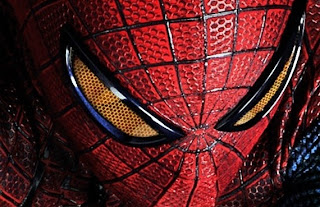
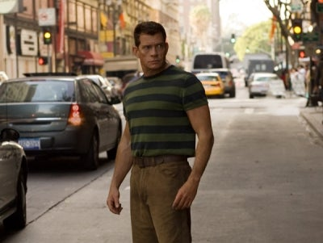

This is my short rant about the villains in the Spider-Man films. You can either [read below](http://www.thoroughmas.com/2012/07/problematic-peace-in-amazing-spider-man.html), or [listen here](http://www.spreaker.com/user/thoroughmas/problematic_peace_in_spider_man):

---

The Amazing Spider-Man. Well, the film certainly did go to great lengths to make Peter Parker even more amazing than your usual Spider-Man.

Even before being bitten by a particularly hungry little radioactive spider, this Peter Parker is a scientific genius, a lovable rebel, a cool skateboarder, and has a heart of gold, which he demonstrates when sticking up for a victim of schoolyard bullying. Removed plot lines discovered by various people on the internet with screenshots of deleted scenes also hint that Peter's mysterious father genetically modified his son in some way to make him even more amazing.

And then the spider bites, and Peter Parker gets super senses, strength, and speed. Who cares that he can't naturally shoot web from his wrists? This guy's a genius, and he can use technology to the same effect.

Spidey then puts these powers to use, combating evil. Evil which quite randomly comes out of nowhere.

One of Oscorp's leading scientific minds, Dr. Connors (whom we already know to be a villain due to over-revealing marketing material and the fact he's missing an arm) is, for the most part, a really nice guy. But alas, driven by the sympathetic desire to complete his revolutionary research, he injects himself with his experimental serum. And uh ... something goes wrong, and he's transformed into a giant lizard monster thing.

Either they mixed up the lizard DNA with some cliché comic plot lines, or lizards are very determined creatures, because suddenly Dr. Connors is filled with crazy new motivations. "I'm a lizard ... so everyone else should be a lizard." Perfect opportunity for some terrible overuse of CGI.

When defeated, though, these lizard motivations seem to fade from Dr. Connors, and he is horrified at what he has done. This sudden sympathetic remorse is not unusual for our Spider-Man villains though.

In Sam Raimi's films, we see Dr. Octavius temporarily led to evil by his ... uh ... conscious metal arms, which he eventually overcomes and saves the day anyway. Venom and Sandman (who, by the way, *accidentally* killed Uncle Ben) are also normal people who get infected by some weird ... umm ... thing. Then there's the Green Goblin ... not entirely sure why he's evil either.

So, essentially it looks like everyone's good in the Spider-Man universe.

Gwen's father doesn't take much convincing to run into battle alongside Spider-Man. The schoolyard bully becomes Peter's best friend. And even the citizens of New York go to great efforts to line up all their cranes so they ... uh ... look pretty?

If there's no one to fight, it's odd that there's so much fighting.

All of that may sound somewhat negative, but I was thoroughly impressed by *The Amazing Spider-Man* and enjoyed every moment.

Yours dutifully,  
**Thoroughmas**