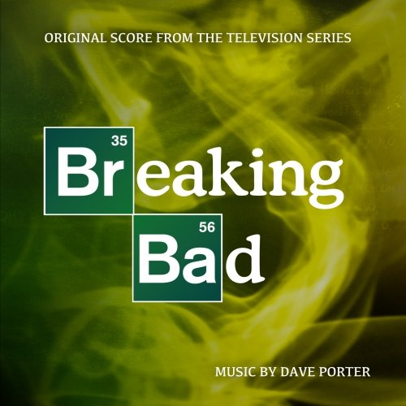

Since the first season aired in 2008, this American drama series created by Vince Gilligan has risen to small-screen fame, and is now one of the most popular shows on television. BREAKING BAD is a dark thriller which follows the story of Walter White, a man who descends into a life of crime in order to provide for his family. Supplying the soundtrack for the show since the beginning is composer DAVE PORTER. His music, however, takes a backseat in this production. It fulfills the necessary action and emotional beats, but never emerges beyond the format of a glorified soundscape.

The opening cue, "Breaking Bad Main Title Theme (Extended)" (1) may not be exciting or impactful, but it is quite assuredly the highlight of the album. The clanging mix of hollow sounds deliberately feels makeshift, even tacky. This represents the whimsical scientific aspect of the show, and Walter's tendency to defuse a situation with ingenuity and practicality. "Smoking Jesse's Pot" (2) is also one of the most accessible tracks. Its optimistic and light-hearted tone is refreshing, and is non-existent throughout the rest soundtrack.

Like many tracks in this score, "The Cousins" (10) uses long, distorted notes to create a dream-like sense of confusion. It is true throughout the score but especially clear in this piece that PORTER is portraying terrible, hollow lives and people with rotten cores. "The Long Walk Alone (Heisenberg's Theme)" (12) isn't much of a theme. A crippled, uncertain melody is repeated several times as the now familiar distorted background noises rumble uglily. It represents Walter's precarious transformation into his darker persona of "Heisenberg".

"Aztek" (14) is one of the few action cues, but it sounds no less bizarre and distorted than the rest of the soundtrack. Its mix of childlike innocence and the rising threat of violence is one of the more interesting moments in the score. "Jesse in Mexico" (16) is enjoyably rhythmic. It doesn't last, but it's something to latch on to as a listener. This track then repeats the depressingly lifeless mix of static stabs ironically innocent light tones we've already been through several times.

The fourth season of the show is coming to a climax in "Crawl Space" (17). This piece follows Walter's motions through desperation, hopelessness and finally madness - symbolised by a building scream of white noise. Hopelessness is visceral in "Parking Garage Standoff" (18), as Walter's desperate plans are foiled by the mysterious intuition of his enemy. The tense, falling tones are disconcerting, giving the sense that something is terribly wrong. These tracks highlight the extent to which PORTER'S score is an accompaniment to the intense madness of the show.

Though it should come as no surprise, PORTER'S BREAKING BAD is an entirely underwhelming listening experience. Don't get me wrong, it is a skillfully crafted score which not many composers could pull off so effectively. On repeated listening this soundtrack gave me a deep, sick feeling, which demonstrates the emotional power it has.

However the rich visual storytelling in BREAKING BAD is so powerful that it makes sense for this soundtrack to be soft and subtle, rendering most of the score imperceptible. Although elements of the soundtrack are interesting when examined in the context of the TV show, where I'd rate the score a 6/10, as a stand-alone listen PORTER'S BREAKING BAD simply fails to deliver an enjoyable listening experience, warranting only a 3/10. In the end, while PORTER'S score has style and ingenuity worth admiring, it is a less than average soundtrack, collecting a score of 4/10.

[Click here to jump over the the review at Tracksounds, including track ratings.](http://tracksounds.com/reviews/breaking_bad_dave_porter.htm)