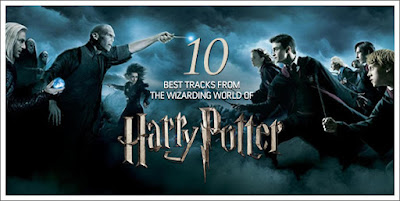

Continuing on from my recent [Top 10 Tracks from Doctor Who](http://www.thoroughmas.com/2012/10/10-best-pieces-from-doctor-who-seasons.html), I've formulated a list of my ten favourite pieces of music from the Harry Potter films. There are a total of eight films, with a total of 181 tracks by some of the greatest composers alive. That made it difficult to choose this list, but it also means that every piece on the list is of brilliant, pure, magical, top-notch quality.

I've already received some feedback from readers who are disappointed to see some great tracks missing, particularly "Buckbeak's Flight". See if your favourites made the countdown! [Click here to jump over to the list](http://blog.tracksounds.com/2012/11/ten-best-tracks-from-harry-potter-movies.html).

Yours magically,
Thoroughmas