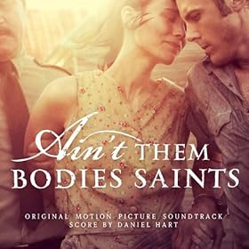

AIN’T THEM BODIES SAINTS is a romantic drama set in the picturesque hills of Texas and featuring the small-scale story of an outlaw who escapes from prison to reunite with his wife. This setting and plot is simple and familiar, leaving the tough job of creating a unique and engaging tone to up-and-coming composer DANIEL HART.
 
Somber independent American dramas have come to sound alike in the past few years. The long hollow tones and eerie, wailing strings are joyless and persistent. In this way AIN’T THEM BODIES SAINTS is a predictable score. Sustained drones are an easy way to fill the sonic space with (seemingly meaningful) sound, and it wasn’t long before they became uncomfortable in my ears.

The dream-like nature of the score as a whole wears thin quickly, and there is little substance to latch on to. This is a common drawback of the ambient, minimalist style soundtrack, but sometimes there is something unique or interesting enough to hold your hand and pull you through. An entry point, so to speak. So what makes AIN’T THEM BODIES SAINTS stand out? Possibly it’s use of human body percussion. For the most part DANIEL HART forsakes drum beats for the more natural sounds of clapping hands and slapping thighs. I am, in general, an emphatic fan of clapping sounds in music. It’s often rather rousing, a fine way to make the music feel alive, and in some strange way - social. It can engage the listener in the momentum. To some extent it is similarly effectual in AIN’T THEM BODIES SAINTS, however the rest of the score is so desolate that it’s hard to get too excited. This clapping quirk is not unique enough to make AIN’T THEM BODIES SAINTS musically interesting for me.

In addition to human body percussion AIN’T THEM BODIES SAINTS sticks to a natural tone in most tracks. Plucked strings twang and acoustic guitars groan. This assists in the portrayal of the setting: a small American country town. Beyond that though, communication is not one of AIN’T THEM BODIES SAINTS’ strong points. The music doesn’t contain many hints at context, themes or messages apart from the obvious and overstated gloom.

Country style rings clearest in “Fixer Upper” (4). There is life in the twanging banjo, but the recurrence of a descending lament of strings is repetitious and ultimately leads nowhere. This cue and the soundtrack more broadly remain on the same melancholy level with no significant changes in texture from beginning to end. In “The Last Shootout” (10) the clapping rhythm becomes the main article, now accompanied by an archaic progression of offbeat percussion and a sustained dreamlike note which hardly changes for 4 minutes. Though this is the most energetic point in the soundtrack, it still feels too subdued and predictable to arouse any passion.

The album ends with 8 songs created by various artists and featuring a cowboy’s stride worth of country style. These are of varying quality, but all are arguably more appetizing than the main score. If you’re interested in these songs that certainly makes the album as a whole a more logical investment, but they aren’t used in the film and they don’t factor into my review.

This score was created to provide a simple bleak tone for the film it is attached to. On it’s own, the soundtrack is a little too ethereal, stagnant and empty. A lack of musical momentum, through rhythm or melody, meant I could never truly engage with the material. AIN’T THEM BODIES SAINTS operates on the same plane of anxious emotion from beginning to end, but since I couldn’t connect with the music in any personal way that anxiety did not become relevant. It’s like watching someone else be anxious, which is simply an uncomfortable experience. The regular use of body percussion struggles to stand as the main musical drive. How unique must a soundtrack be to be enjoyed on its own? A stretch more unique than this score, I would argue.

If you enjoy minimalistic dark scores with eerie, depressing atmospheres, maybe AIN'T THEM BODIES SAINTS is one for you. However for the rest of us the complete lack of variety and melodic material makes this a fairly ordinary listening experience.

[Check out the review on Tracksounds, including track ratings.](http://tracksounds.com/reviews/aint_bodies_saints_daniel_hart.htm)