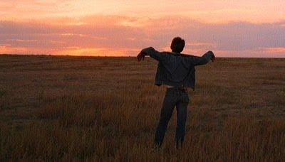

Terrence Malick's *Badlands* tells a dark and dreamy legend which explores the psychology of an unemotional teenage girl and the murderous man she runs away with. Martin Sheen and Sissy Spacek star as Kit and Holly, an unpredictable, offbeat and unconventionally mischievous pair. Both appear somewhat queer at the beginning of the film, but develop into truly confronting characters as they become increasingly desensitised to the violence they bring about. Though their attitudes are always nonchalant, they are undoubtedly the drivers of their journeys. Well, perhaps Kit is the predominant the driver for them both. It is he that first approaches Holly at the beginning of the film and pursues her determinedly, leading him to shoot her disapproving father (the first of Kit's many "nuisance-removing" murders).

The extroverted soundtrack is loud and intrusive and should by all rights be jarring, but in actual fact it blends well with the film's themes. The high-pitched repetitive melodies emphasise the "fairy-tale" viewpoint of the protagonists; their whimsical journey of carefree destruction across the American countryside. Similar juxtaposition is key to Holly's monotone narrations, which - often humorously - completely undersell the gravity of the characters' circumstances.

Cleverly, the true focus of *Badlands* is only revealed in the film's final scenes. While most of the film feels like a plot-driven journey which could easily build into a meaningless final showdown, when Kit shockingly surrenders himself to the authorities his character becomes the primary subject. Malick clearly understands that the audience is intensely interested in why Kit would do such a thing. Kit shifts so dramatically into the centre of the film's spotlight that it feels like we are seeing him properly for the first time. He is shown to be more charismatic than ever before. It's a subtle character twist which, similar to plot twist films like *Sixth Sense*, forces the viewer to see the entire film in a very different light. All of Kit's motives are thrown into question. One of the most intriguing ideas in storytelling is that of the likeable villain, and Kit is exactly that. In the final scenes the audience is made to struggle with the fact that they are feeling sorry for this psychotic murderer. The film lives beyond its runtime in these unanswered questions of subjectivity, justice and how one should classify psychosis.

