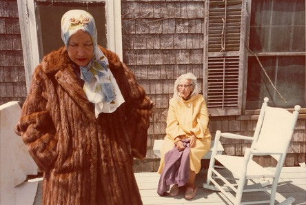

*Grey Gardens* is an understated documentary about the relationship between a mother and daughter. Edith Beale (or "Little Edie") lives with her mother of the same name (or "Big Edie") in a large, isolated, deteriorating house. That's the simplistic premise. It works exceptionally, however, due to the incredible depth and subtext of the uncomfortable relationship between the Beales women.

Thanks to the naturalistic shooting style of directors Albert and David Maysles, the film feels authentic and immersive. With long unedited takes of the Beales living their everyday lives, the audience is allowed complete and objective access to this rather tragic household. It's like a nature documentary. We get right up close with these interesting specimens in their natural habitat, and we get to observe them for a good long while. It works brilliantly; the Beales are never shy of the camera - bickering unattractively and spilling forth their inner monologues. Without concern for story or plot development, one can easily forget it is a film, truly focusing in on these strange real life characters.

In the isolated, shrub-encircled house, conflict arises naturally between mother and daughter. We learn of tensions between the two, particularly in regards to their respective successes. Big Edie is an accomplished singer who maintains somewhat of her singing voice in old age. However, when Little Edie sings on several occasions, it greatly upsets Big Edie, who spills forth criticisms and objections. Whether ashamed, threatened or just wanting to be appreciated for her talent, Big Edie's passive aggressive manipulation of her daughter is intriguing social commentary. The film portrays a realistic chunk of family rivalry, up-close and personal.

Cutaways between scenes depict birds and planes flying above the house, a motif that hints at the outside world - free and constantly moving. This contrasts with the two women's stagnant lives - a situation they are blind to, reflected metaphorically in their terrible eyesight (Little Edie even using binoculars to see short distances).

The depth of material the film reveals in such a small physical area and with a leading cast of only two, is incredible. *Grey Gardens* demonstrates that interesting narratives, characters and relationships do not have to be scripted.

