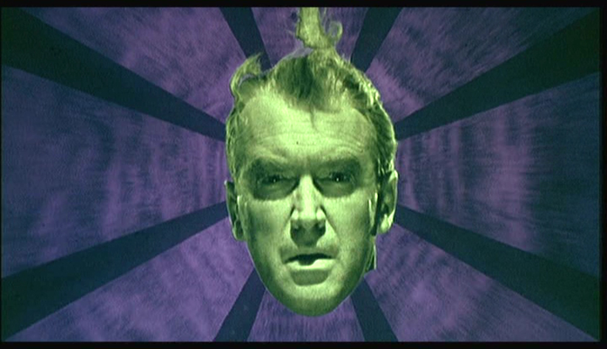

Hitchcock's *Vertigo* is a perfectly paranoid thriller about trickery, fear and obsession. The narrative follows James Steward as John "Scottie" Ferguson, a retiring detective who suffers from acrophobia and vertigo. Through the film's abstract subterfuge of eerie effects and dizzying (vertigo-inducing, one might say) editing, we watch as Scottie investigates a mystery that makes him lose his mind.

The film's second act is difficult for the viewer, as events twist about awkwardly and Scottie is plagued by an unrelatable madness, so it is fortunate that the first act introduces us to an exceptionally engaging mystery. We, with Scottie, investigate Madelein, an inscrutable yet beautiful woman who does not seem to make sense. Scottie's obsession with Madelein escalates dramatically until the shocking moment when she plunges to her death from the tower of a mission. From that point his obsession is thrown out of focus, and he projects his mania into hallucinating that other women around him are Madelein. Editing trickery allows Hitchcock to make us see what Scottie sees: recurring instances of approaching women who appear to be Madelein, then change into a stranger as they come closer.

Scottie fixates on a particular woman who looks like Madelein (whom, fate has it, is Judy, the woman who impersonated Madelein as a part of a murder plot). In his mad attempt to have the unattainable, Scottie works to craft Judy's appearance into that of Madelein, despite her understandable protests. In this way his "love" is shown to be entirely self-indulgent.

Bernard Herrmann's score is divine. Punchy and often bombastic, the music punctuates the film's action and emotional beats from the word go, providing a rather affecting visceral experience. The score is as obsessed with its key romantic melody as Scottie is with Madeleine. It is a beautiful theme which is reprised dozens of times throughout the film to emphasise the heightened relationship. However, as with the reality of the relationship, the melody - when played in its complete form - flows from swirling beauty into a troubled stumbling of emotions.

The question arises of whether or not *Vertigo* is a romantic film. There are elements of romance, as Scottie is clearly infatuated by Madeleine and he pursues her like a lover. However, particularly in the final act, he is not very loving in his actions. He dominates Judy and drives her into a worked-up state of fear through his desperate madness. There are many instances in the second half of the film where it would feel appropriate for the film to end, but they are glazed by. Instead the characters go all the way into the madness, keeping the narrative alive until Judy dies like Madeleine, and then ending abruptly in that moment of horror. *Vertigo* can be perceived as an anti-romance film. It's a story in which love - one of humanity's most optimistic traits - is twisted into dark, narcissistic obsession.

