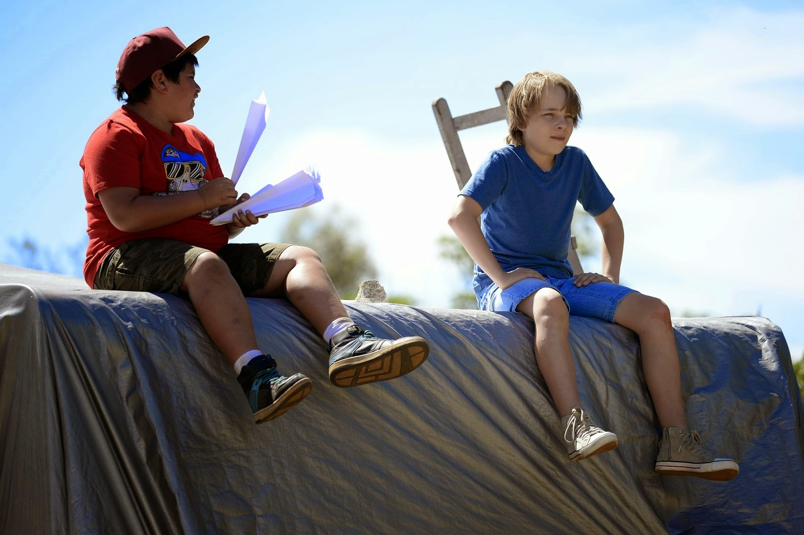

This week I got a chance to see this new Australian film directed by Robert Connolly at the Melbourne International Film Festival. It's called Paper Planes, and although it appears to be marketed as a film for kids, I'd argue this move has something for all audiences. But then, now that I consider it, all great children's entertainment can be enjoyed by everyone.

For myself, and I daresay most others, the expectation when seeing an Australian film is somewhat lower and more cautious than when seeing a film from any other part of the world. Australian cinema has simply lacked imagination for most of its existence, excluding a brief run of comedy (The Castle, The Dish) and a foray into a dark depiction of suburbia (Animal Kingdom, Snowtown) - a fetish from which we are only just emerging.

So it is with this caution that I sat down to see Paper Planes, but to my delight I found myself totally immersed in this incredibly cheerful film. It was a fantastic experience, no doubt heightened by the fact that each audience member was given a sheet of paper upon entering the cinema, with which to create a plane to toss across the theatre at will. This resulted in a very realistic 3D experience - without the need for big black spectacles - as an assortment of newly-constructed paper aircraft dove above our heads throughout the film (often jabbing an unsuspecting elderly gentleman in the face), making me regret the fact that I deliberately butchered my sheet of paper into a flightless creative mess. Sometimes I worry I'm becoming the kid who jumps on sandcastles.

Paper Planes is an upbeat film in the vein of The Rocket. The narratives are both essentially the same, and predictable. Kid dreams of winning a niche tournament of some kind, overcomes many hurdles, probably succeeds - or at least learns a lot a long the way. But as the titles of both of these films clearly indicate, one is about rockets, and one is about paper planes.

Things move along at a fast click; I was never bored. Cleverly, the film introduces the audience to the fact that it is not set in reality early on. It's not a film that takes itself seriously, and you have to accept that. This ungrounded tone is something I often struggle with, but after the first ten minutes or so I was in. Like that shifty kid from Les Miserables, the sheer charm won me over.

And oh yeah, it's charming. The film oozes colour and enthusiasm and optimism. Take the teacher character for example. Played by Peter Rowsthorn, he's goofy and funny and his students love him and so does the audience. The way he is encouraging and doesn't underestimate others is refreshing and makes him not only a great character, but also a great role model.

This is a children's film in the best way. It doesn't pander to young audiences but nor does it forsake them. The young characters are probably as mature as they can be without slurping whiskey and losing their hair. It's fantastic, and Ed Oxenbould is astonishingly charismatic as the young lead, Dylan. In most films or TV shows, when a child is given a witty line it comes across forced, false or cheesy, but Oxenbould is totally relaxed on screen, and Dylan is a complete character with enough range to make the audience laugh and cry and truly get behind his motives.

The narrative is a pipe dream for classroom introverts like myself. I could relate to Dylan immediately when we are introduced him riding his bicycle down dry dirt paths to school, where he sits quietly in the classroom surrounded by a cacophony of overexcited kids.

Sam Worthington is adequate as the morose couch-ridden father, but arguably more captivating is David Wenham as the father of an arrogant narcissistic boy - the antagonist. It's very Veruca Salt from Charlie and the Chocolate Factory. For most of the movie, Wenham is basically the father Oxenbould desires, and I found their one scene together on a mini-golf rooftop in Tokyo particularly engaging.

The soundtrack by Nigel Westlake also deserves a big callout, it's excellent. Big, lively orchestral scores will excite me in even the most tedius films. But Westlake goes a step further with the integration of his music, playing with and off diegetic beats, for example using synchronising the start of a cue with the sound of a character slapping a table (not a specific reference - I forget exactly what kind of object the character was slapping).

My excitement hesitated a little at the end, with what felt like a slightly forced conclusion. I can shake that off though. My desire for a realistic conclusion doesn't complete ruin my enjoyment of this deliriously happy one.

It's only once the film had ended that I realised exactly what the film had achieved in regards to the coolness of paper planes. Just like the irrepressible desire to become a pirate after watching Pirates of the Caribbean, Paper Planes sold the magic of the concept of paper planes. Kids ran out of the cinema with at least one in each hand, spreading a contagious excitement. I entered thinking "paper planes? That's cute." I left thinking, "hell yeah - paper planes!"

As I guess you can probably tell, I liked this film. More than expected, more than most of Australian cinema, and more than enough to recommend it.

Yours frenziedly,
Thorough-still-can't-make-a-paper-plane-for-the-life-of-him-mas