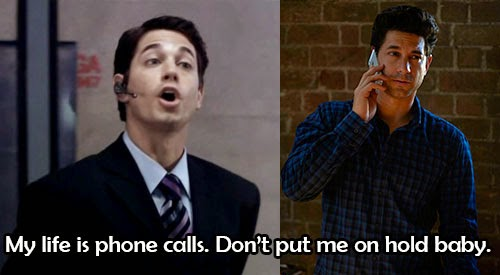
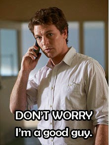
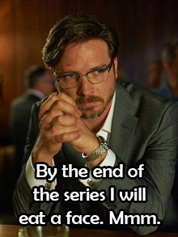
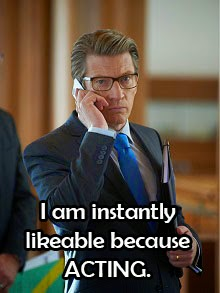
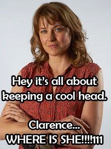

Last week I checked out the first episode of ABC's new political thriller series and, in an epihpany worthy of thriller storytelling, I found myself at the heart of a mindbending social media experiment. I realised that the episode had not actually been released, and that only myself and 299 other people were allowed to have an advance-preview. Why? So that they could sucker us into writing a review of what we had seen! They're forcing their viewers to do the dirty selling work for them! Crazy! I love it.

This innovative stunt requires a fair bit of confidence in the product. And I believe the ABC's confidence is not misplaced in The Code. This isn't just another Australian drama for the pile. We all know how the Australian film and television industry can struggle to keep up with the rest of the world, particularly in the drama-series department. The Code is a solid effort to emerge from the mediocrity.

Three paragraphs in. I will actually start reviewing in the next paragraph.

I'll start by noting the first thing that struck me about The Code. It's something that I think plays a major role in its so-far success. The show is not overtly Australian. I feel that's a common pitfall of original Australian content - appealing to some kind of Aussie stereotype. As if the only interesting things about our country are the babes, the beer, the barbeques and the bogans. The Code doesn't pursue such cliches, instead diving into storytelling that is set in Australia but not necessarily entirely about Australia. It's reflected in the accents too, which aren't as twangy with the down-under dialect as the common filmic depiction of our big island. Personally I find this refreshing. Maybe sometimes I'm just secretly a bit embarrassed by Australians. Actually, it's not a secret. Put a shirt on.

This accessibility could be a factor in [the show's quick sale overseas](http://www.smh.com.au/entertainment/tv-and-radio/abc-political-thriller-the-code-sold-to-the-us-20140404-36330.html).

20 minutes of the episode had passed before I properly engaged with the plot, but that's understandable in a big pilot like this, with many characters. It's clearly also a large story in it's infancy, with a lot of threads to introduce. By the end if this pilot, however, events reach full-stride and, without spoiling anything, it concludes with a satisfying triple-threat cliffhanger involving snatching, sexing and suicide-ing. Careful stepping around my effortless alliteration.

The actors in this show rock. Dan Spielman stars (I think... it's quite an ensemble) as nice good-guy audience-surrogate working-out-stuff Ned Banks. Ashley Zukerman has a bit more acting to do as Jesse, Ned's socially-challenged hacker brother. Yeah, he's one of them hackers. Convenient, and a bit of a suspension-of-disbelief hurdle for me, but I'm already over it. I hope Mr Zukerman would not be offended to hear that I think of his performance so far as a cross between Iwan Rheon in *Misfits* and Josh Thomas in *Please Like Me*. A combination of the stiff discomfort of the former and the physical impatience and fluid limbs of the latter. Yes, the fluid limbs. Serious thrillers can easily feel flat, but Jesse's character combats this with unpredictability and a healthy enjoyment of wordplay.

Probably a safe bet as the big-bad is Randall Keats, played elegantly by Aden Young - whom I am most familiar with in *Rectify* so it will take me a while to come to terms with his Australian accent. Also did I see David Roberts in a journalist scrum? Hope so, otherwise this is awkward.

Oh and how can you not love David Wenham?

As a massive soundtrack nerd I was clearly interested in how The Code would use music. And lords and ladies I am pleased to report that the score (by composer Roger Mason) went above my expectations. It's nothing too crazy, but unlike a lot of television it's there and it's good. I'm a big fan of the way Mason is blending sci-fi-esque pulsating drones with delicate, classical piano elements. The music does a lot of heavy lifting on selling the tone, as it should with any film or TV. I'm looking forward to hearing more.

For the most part the show is visually impressive as you would expect. It's swashed in blues and blacks, emphasising the sterile nature of Canberra interiors and contrasting with some of the red-dirt country locations we see. Some of the camerawork was a little too impatient for my liking, though, in scenes crafted with shaky hand-held close-ups mixed with a narrow depth of field. It's not unexpected - this is a very popular style on TV today, but it's something that pulls me out of the drama. That said, for each shaky cam scene there was a more reserved, subtle and comprehensible scene where they "put it on a tripod", so to speak.

Effects-wise, The Code takes after this very-cool modern trend of using animated on-screen overlays to represent what a character is looking at on a computer or phone screen. But wheras a show like Sherlock uses this technique sparingly, The Code goes kinda crazy with it, which I love. Not only is it an essential storytelling device (what better way to present information in a "hacking" scene?) but these effects become increasingly slick throughout the episode, and make what would otherwise be dull one-person-typing-at-a-keyboard scenes rather engaging.

As a diligent television scientist seeking the truth, I undertook my own test of this filmic device, comparing a computer-use scene in my own bedroom with and without on-screen visuals:

[YouTube Video](//www.youtube.com/embed/xR_eIF9pfF8?rel=0)

The big question is whether The Code can compete with current great political thrillers thrilling it up (a technical term) overseas, the likes of <i>Homeland</i> and <i>24</i>. The answer is not yet. The Code is not shining yet, but it's got legs. The pilot left me optimistic, and with a cliffhanger I care about and five more episodes to prove itself, The Code is one to watch.

The series premieres for all on Sunday the 21st at 8:30pm on ABC.

Yours thrillingly,

Thoroughmas

