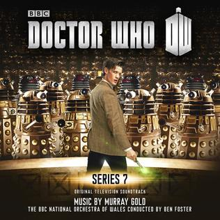
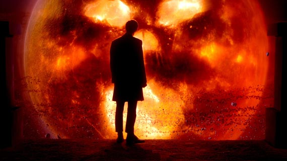
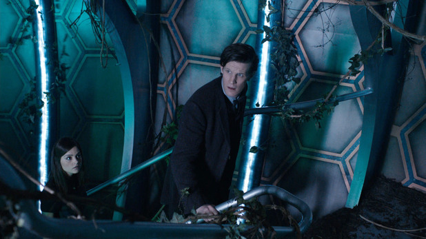

Doctor Who’s original scores by MURRAY GOLD rank among the most brilliant and rewarding soundtracks of recent years. Time-travelling along at a release rate of annually-at-least, each album so far has been jam-packed with enthusiasm and overflowing with life, love and creativity. You could almost say they’re bigger on the inside. 

Does GOLD’s new album from the show’s 7th season match the enormously high bar that has been set? Spoilers! But yes. Yes it does. Granted, with 74 tracks, adding up to well over 2 hours of music, it’s hard not to be at least a little bit impressed.

A significant portion of the fun of a Doctor Who soundtrack is picking out GOLD’s self-references to his previously established themes - of which there are many. Sometimes these reprises are thrillingly subtle, like the return of the Dalek’s theme in “Towards The Asylum” (1-5), and sometimes they are splendidly overt, like the 11th Doctor’s Theme at the end of “I Might Change My Mind” (1-37). GOLD is happy to dance from theme to theme at a rapid pace, often within the same track. This emotional whiplash can make your first listen exhausting. Furthermore this score has many styles sewn imperfectly together; dramatic jumps between disparate themes and genres. This makes it unclear what the central drive is for the album as a whole, probably to a greater extent than any previous Doctor Who score. But in subsequent listens, when you know what formerly unpredictable emotional rises and falls to expect, the journey becomes significantly more enjoyable.

There are some other downsides to having an overwhelming 74 tracks. Many tracks clock in at under a minute, which is hardly enough time to truly immerse yourself in a great piece. Notably, “Bah Bah Biker” (1-35) and “The Speeder” (2-6) are wonderfully energetic new melodies, but they have no room to breathe. Perhaps GOLD will expand upon these in future years, as has been his custom with other motifs in the past.

The creepy first section of tracks tred us tentatively into the Asylum of the Daleks, a world dark with danger and insanity. GOLD is notorious for his maniacal cheesiness and utter bombasity, but “They Are Everywhere” (1-1) is a poignantly reserved opening to the soundtrack. Effective features are the escalating string motifs and the use of deep, sombre horn for a majestic quality.“Towards The Asylum” (1-5) is pure GOLD. Classical influences, subtle hints at past themes, a marching beat with powerful momentum, and some banging. The flute, however, is something we haven’t heard in Doctor Who previously, and proves an effective new instrumental style.

“They Are Everywhere” (1-1) foreshadows the two-note bass rhythm of “Together or Not at All - The Song of Amy and Rory” (1-28), a tense and emotional piece which begins to farewell the characters of Amy and Rory. There’s so much tragedy built into the rising melody. By the end of the piece percussion and vocals have joined the mix, in case you didn’t already have something in your eye. “Goodbye Pond” (1-29) is the true goodbye, though. It begins with a slight, tortured rendition of Amy’s signature melody before exploding into an orchestra-encompassing interpretation so powerful and breathless that it can only mean the end of a character. The track doubles as a wonderful goodbye to the melody itself, which certainly shall be missed.

Dabble your tears, let’s materialise into some other recurring melodies. Geronimo! The catchy fan favourite no one can get enough of, the 11th Doctor’s theme, makes several fresh appearances. It’s the highlight of “I Might Change My Mind” (1-37) and “Some Wednesday” (2-29). It also appears in “My Husband’s Home” (1-25), which evolves into a beautiful rendition of Series 5’s “The Sad Man With a Box”. All of these are fragmented crumbs compared to “Up The Shard” (1-36), which is the most complete reprise of the theme, heavily accented with loud orchestral banging, wailing and tumbling. It’s glorious. The most important recurring theme in this score however, is a new one. Accompanying the mystical and adventurous new companion, Clara’s theme is fluttering, lightweight, romantic and magical. It has a gentleness that goes back to Rose’s Theme of Series 1. This new melody is introduced at a basic level in “Oswin Oswald” (1-4) and reprised briefly in “A Probe in the Snow (1-6), but it is not until “Clara?” (1-33) that we get a complete rendition. At this point one might get nervous about overuse, but there is just enough variation in “The Leaf” (2-1) and “A Letter to Clara” (2-31) to keep the candle burning on Clara’s theme. I am glad it wasn’t spread any more thinly than that, it’s such a light melody it just might disintegrate.

GOLD has fun playing to a genre, and it’s contagious for the listener. This season we’re treated to a Western setting. Doctor Who dabbled in Western sounds in Series 6 with “I Am The Doctor in Utah”, but GOLD’s approach is much more full-fledged this year, from the madness of “Make Peace” (1-12) to the solemn goodbye of “Our Little Town’s Prosecutor” (1-17). Standouts in this section are “Welcome to Mercy” (1-13) and “The Salvation of Kahler Jex” (1-16) which both feature gorgeous vocals by singer Halia Meguid, who has been involved in Doctor Who previously as Series 6’s “Deady Siren”.

The first disc ends with triumph. Trademark Doctor Who brass is abundant in “A Turbulent Flight” (1-34), an action-packed two minutes featuring just about every kind of horn-tooting in GOLD’s arsenal. Then there’s his love of blurring the line between song and score, realised in the catchy “Bah Bah Biker” (1-35). This is followed by “Up The Shard” (1-36), which teases the 11th Doctor’s theme before bursting into probably the most triumphant rendition we’ve ever heard. Finally, “I Might Change My Mind” (1-37) flutters and tinkles like a happy ending, then grows ever darker and more mysterious, entwining Clara’s theme and descending into melancholic peace. But of course, just when you think it’s over, the 11th Doctor’s theme returns again - ending the piece with all the power and excitement we love from MURRAY GOLD and Doctor Who.

From “Market Day” (2-3) to “Infinite Potential” (2-9) we are in the score for The Rings of Akhaten episode. A dreadful 45 minutes of television in my opinion - but that’s irrelevant, because the music is jaw-droppingly, spine-tinglingly, life-affirmingly stunning. Through these tracks choir vocals are slowly incorporated into the sombre, building melody which isn’t played in it’s entirety, only teased until the ultimate piece, “The Long Song” (2-8). There are many emotionally potent tracks on this album, but “The Long Song” wins the ultimate tear-jerker award. Three quarters of the way through the song the lyrical vocals fade away and a spine-tingling rendition of what sounds like certain sections of the 11th Doctor’s theme fills the space. This is arguably the peak of the entire album. Completing this section of the score is “Infinite Potential” (2-9), which gives one last salute to the beautiful melody and ends with all of the orchestral composure one would expect from a first class John Williams score. MURRAY GOLD has come a long way since 2005, and he’s comparable in every way to the greats of the film music.

Following is a section of Cybermen-themed tracks. As always MURRAY GOLD can be relied upon to reprise his original theme for the Cybermen from Series 2, however this is no exciting revamp. This section of the score is contrastingly flat. Uninvolved melodramatic padding is to be expected in a two hour score, and most of it lies around here. It's perfectly acceptable connective tissue, totally overshadowed by the wealth of brilliant pieces surrounding it. 

Did someone say brilliant pieces? Oh yes, I did. “To Save the Doctor” (2-30) sees the exciting return of Series 3’s theme for the Doctor’s homeworld, Gallifrey. Another stylistic rehash is “Pain Everlasting” (2-36), a piece similar in manner to Series 5’s “Impossible Choice”, with a Prisoner of Azkaban-esque hollow lead. 

“Remember Me” (2-37) is a powerful end to the album. It opens with a final simple rendition of Clara’s theme before transitioning into a cheeky, hammering rhythm which is - as is often the case with Doctor Who - just one step short of sounding very cheesy. Keen listeners will notice it melds together aspects of the 10th and 11th Doctors’ themes (something I wish we had heard more of in the 50th Anniversary Special).

Doctor Who’s 7th season since the revival in 2005 may have been the most rough, inconsistent and convoluted, but MURRAY GOLD’s music hasn’t missed a beat. Once again he has struck a pleasurable balance between introducing new themes and rehashing old ones. A few new themes stand firmly among GOLD’s best, and I hope we’ll hear these spectacular earworms again in the future. The only disappointment here is how short-lived some of these wonderful tracks are, but you can only spread butter so thin and you can only squeeze so much brilliance out of a composer each year. 

This soundtrack isn’t surprising, but it does stand strong beside it’s stellar predecessors. It’s a no-brainer for anyone with passing interest in Doctor Who or MURRAY GOLD, who appears content to continue manipulating our emotions and skyrocketing our adrenalin for years to come.

