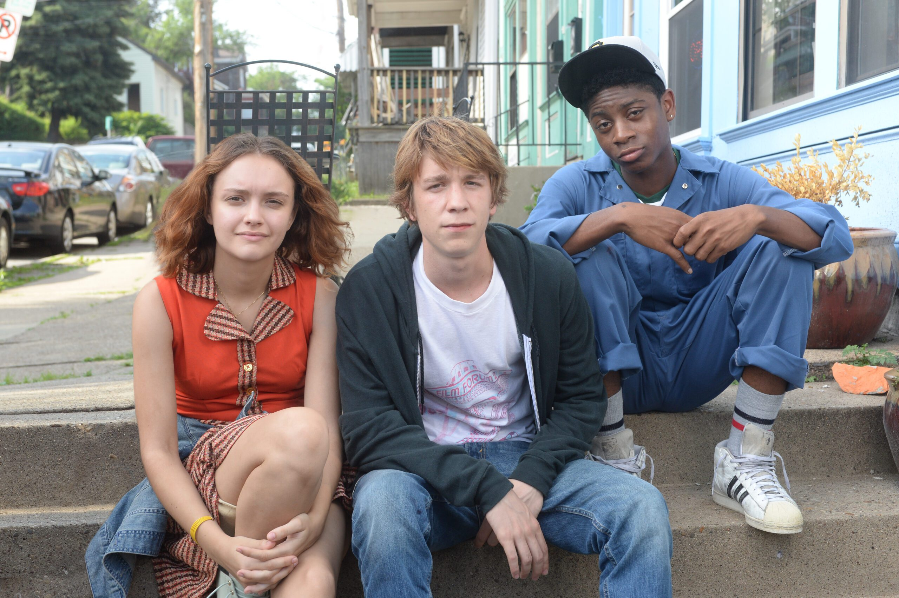

A fun film which is stuffed full of indie tropes, including the *makes-fun-of-indie-film-tropes* trope. I had a great time until the third act in which the film ditches its humour (its most unique feature) in favour of an emotional ending which was good but felt fairy stereotypical and unoriginal. The first two thirds of the narrative had a quirky and unpredictable edge, whereas the resolution looked eerily like something I've seen in a lot of other movies. Big ups to the proficient-beyond-their-years cast and the determined-to-entertain cinematography. This is a film that benefits (and in my case, benefited) from a loud, emotionally invested live audience.

Him, Earl and yes, the Dying Girl too, were a charming trio to spend several hours with, but - although they certainly tried - they didn't quite change my life. The film is however finding great success around the world thus far, so I look forward to seeing some of these actors and filmmakers around the cinema more often in the near future.

