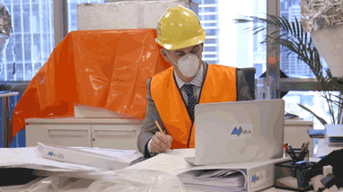

This weeks recap is going to be quick and basic. Just reliving a few of the best moments from Utopia's latest episode!

Like the time Tony became an expert on interior air-current measuring.

Or when the HR lady couldn't have been more condescending.

The gloriously inconsequential waiting room mix up.

The ironic iconography of our "Nation Builders" dressing up like umm... "real" builders.

Woe is the reluctant translator.

But once again we see that Tony and Nat can actually get things done and sorted very quickly when no one else is in the room.

Finally, Karsten took overhearing insults against him very well. This is what mindfulness can do for you, folks.

Hasta la vista folks. Adios.