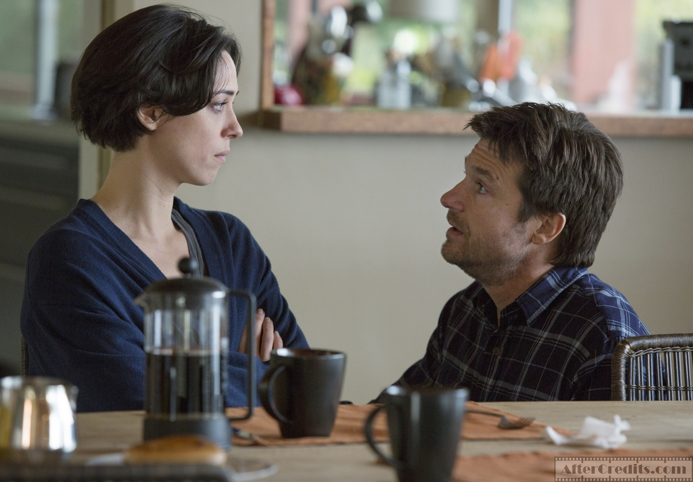
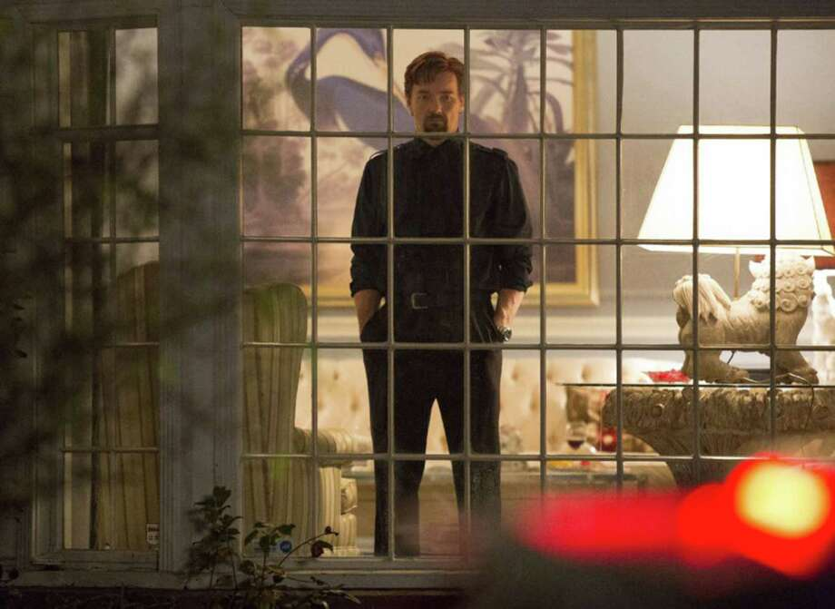

How can you pursue a "fresh start" when you're the same person you always were?

If you haven't seen it, I'm going to say here - at the top - that I thoroughly enjoyed this film, and think it's a particularly excellent experience if you go into it knowing very littleabout the plot and characters. So I advise that you only read on if you have either seen <b>The Gift</b>, or you don't care about me trying to care about you right now.

<b>The Gift</b> depicts the slow and fascinating disruption of a married couple when they start to receive visits from an old friend. Now, that synopsis actually makes the film sound rather dull to me. But actually, the film is so laser focused on the three lead characters, on peeling away their layers, that the drama quickly becomes far more fascinating. From the opening scene it's all about learning who these characters are and, before long, relearning. Very little actually occurs during the film to change them, but as a viewer, discovering more about their pasts twists your affections in shocking ways. A powerful theme of the film is the question of whether a person can change, as an adult, from who they were as a child.

Like any superb thriller, <b>The Gift</b> plays on the audience's expectations. The film builds slowly, planting small seeds, aware that they will grow and multiply in the thinking viewer's mind. It reminded me of last year's <i>Gone Girl</i> in this way. Between every scene I felt the desire to turn to those around me to ask, "What do you think about [character] now?"

Perhaps it is thanks to the simple and relatable hook of the film (a visit from the past) that I found the audience to be pulled in very quickly. We wanted to know more about these characters, and before long the film made us regret it (in a good way).

Almost as an experiment to test audience engagement, the middle section of the film includes a series of jump scares (some of which pop, some sizzle out, and some are red herrings). In my screening, we were all hooked. Every time the cinematography forecast a potential jump scare the whole cinema tensed up. Then when the film relieved the tension, laughs, gasps and sighs echoed from every seat. This isn't a horror film, and we weren't a horror audience, so we didn't <i>want</i> to be scared, and that's why it was so effective.

I could see absolutely no flaws in Jason Bateman's performance. It's a similar character and performance to his great role in <i>Disconnect</i>, although <b>The Gift</b> goes much deeper. The audience is shown many more sides of his character than is comfortable. Like many actors known for their comedy, I have always preferred Bateman in dramatic texts.

Rebecca Hall plays a complex role with a wealth of honesty. For the most part, her character is the closest we've got to an audience surrogate. Therefore it is extremely satisfying that she is portrayed with so much intelligence and agency. Many similar characters in other films are ignorant of danger or poorly perceive the events around them, but Hall's character does everything I would have done in her situation - and that's fantastic to watch. The frustrating horror in which the victims never call the police, this is not.

And this point goes across the board. There are half a dozen side characters who appear throughout the film who all seem like such realistic, living characters - even with very minimal screen time. Characters on screen are not often this perceptive of each other, this intricate. Well written, well directed.

Speaking of... how Joel Edgerton wrote and directed this film while giving his incredible, subtly aggressive performance is difficult to comprehend. His became one of the scariest performances I've seen in a while, without even a creepy smile. And it's frightening because it feels so true, and so tragic.

The haunting soundtrack is simple and very effective. Composer Danny Bensi knows how to creep into the back of your mind and disturb you. The score keeps close to a delicate, ponderous little theme for the most part, except when sonic madness is required, which - judging by my tense muscles at the end of the film - was delivered effectively.

The overarching messages of the film are bold, challenging, devastating, but most importantly - <i>important</i>. These are ideas worth spreading (oops hi TED). And tying it all up in a puffy red bow,&nbsp;<b>The Gift</b> is a thrilling character drama which will haunt me forever.&nbsp;Touché, Edgerton, I'll see you in <i>Black Mass</i>.

