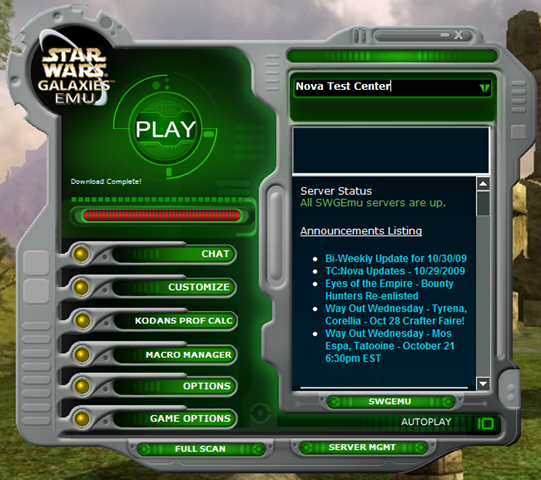
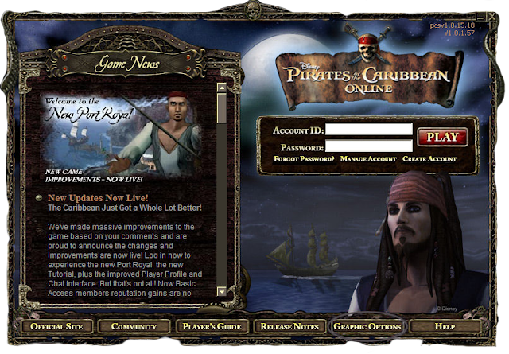

*Please be advised that most of this listicle is based on memory and opinion rather than research and fact.*

Some used sounds, some had moving graphics. Some displayed the latest patch notes, some allowed you to login, or pre-download a future patch. But whatever they were like, all kept your game updated. If you've played any MMO, you've spent a long time looking at them. Therefore its easy to feel pretty nostalgic about some of these launcher windows. And there are a bunch that have been changed over the years, or are connected to a game that's been discontinued. And with Star Wars: The Old Republic recently completely redesigning its launcher, I was prompted to make this little list of a few launchers I remember the most fondly over the years.

### 5. World of WarCraft

First on my list comes the original launcher for the biggest MMO around. It had a cool themed aesthetic, updated with each expansion to the game. As you can see I've included a picture of the Wrath of the Lich King launcher. It also came equipped with patch pre-loading. It was a cool, basic launcher.

### 4. Star Wars: Galaxies

SWG's launcher was the most feature & information rich of any MMO I've seen. Unfortunately I can't actually find an image of the real launcher, so this screenshot of the SWG EMU launcher will have to suffice. (If you do have a shot of the original SWG launcher, please let me know!) To my fallable memory I believe SWG's launcher displayed server status, server selection, patch notes, and even allowed you to adjust in-game settings before you hit Play.

### 3. Star Wars: The Old Republic

The most recently abandoned launcher on my list, Star Wars: The Old Republic used to patch with this smooth, slick and cool window. Featuring the game's signature orange and blue colours, it displayed patch notes, along with some basic game alerts and updates.

### 2. Warhammer Online: Age of Reckoning

Probably coloured by how excited I was for this game before it launched, WAR's launcher is to me a thing of beauty. It used two golden progress bars and featured the latest patch notes in full. I believe it eventually allowed you to launch the game while you were still downloading files. And those two war hammers sticking out the top are just great design.

### 1. Pirates of the Caribbean Online

Disney's Pirates of the Caribbean Online was a small MMO with a very fun launcher. It displayed updates and patch notes, allowed you to login and could stream game files after you hit Play. One iteration of the launcher also displayed a moody looped video with a pirate ship sitting under a lightning storm.

By the way, did you know Pirates of the Caribbean Online had a 3d version? Crazyness. It was awful but so wacky.

Well that's my top five. I've tried a ridiculous number of MMOs, but unfortunately not all of them. So if you have a favourite that I haven't included, I'd love to hear from you in the comments below!