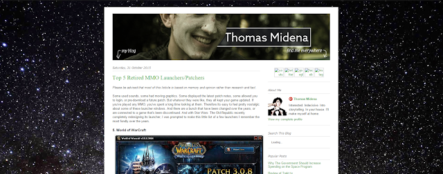

Over the past few days I have been tearing down webpages, transferring domains, trawling through templates, scribbling CSS (very carefully – I ain't no master coder) and basically just destroying my website so that it can be reborn. The primary goal being, to use a bunch of webdesign jargon: a more dynamic, customisable and content-rich experience.

So it is now that I say good night and good luck to my old Blogger page:

And good morning and good luck to this new website you're looking at right now.

This new site is still pretty bare, possibly a bit too white, and lacking some pizzazz, but over time it should come to feel more "lived in". Already I'm feeling pretty good about it. It's clean and simple and allows me to present of a lot of my work.