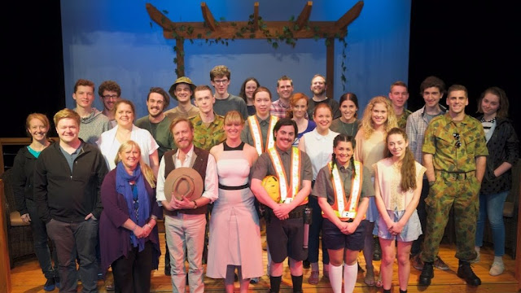

Yesterday was the final performance of Third Door Theatre's production of Shakespeare's Much Ado About Nothing, in which I had the juxtaposed joy of playing the melancholy villain, Don John. It's always strange when a production like this comes to an end; suddenly there's no great practical reason to see all the cast and crew you've spent a huge chunk of your life with for months. This one's a particularly bittersweet goodbye however, because it really was a cluster bomb of awesome.

I've always been a huge fan of Shakespeare, so it's been enormously fulfilling to be a part of this big, thoughtful, fully-fledged and *really* fun production of one of the bard's best works. And to be the villain was never something I anticipated, as I've certainly leaned towards comedic roles in the past. The role of Don John ended up being a wonderful challenge with intriguing themes. It was often kinda cathartic to delve into that dark melancholy.

And I was surrounded by the most exceptional cast. I've seen a fair few productions of Much Ado in film and theatre, and it's such a joy to be able to honestly say I think the characters were all portrayed better in this show than anywhere else I've seen them. From Benedick and Beatrice to Hero and Claudio to Leonato and Don Pedro to Margaret and Ursula to Dogberry and Verges and the rest - these characters were so funny and real that I feel like they truly existed. After months of rehearsals and ten shows I wasn't tired of watching any of it.

And, hard to believe that it's possible, but these actors were just cool off-stage as on-stage. The overflow of camaraderie can be attributed to director Cale MacLaren, who undertook nurturing this big theatre family with the utmost sincerity and encouragement. Cale's talents as an actor, director, wordsmith and builder of bonds made this production special.

The deliciously sentimental thing about the nature of theatre is that this production is now little more than memories. But these ones are gonna last.

