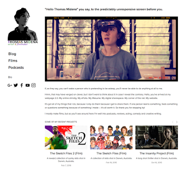

Feels like only last year that I had a brand new website (it was).

The website you're currently looking at (unless you're pretty far into the future, in which case hi can mobile phones do 3d printing yet?) is the latest website I'll be using to share with you whatever trouble I get up to so that you can feel like a co-conspirator (or alert the authorities). It was built with blood, sweat and [Drew Collins](http://drewcollins.me/). It's nice and green and makes it very easy to see my latest [Projects](http://thomasmidena.me/projects) and [Blog](http://thomasmidena.me/blog) posts.

Just like last year though, I feel the need to tip my hat to my previous website. It had charm. Its existence was marvellous and, like all great things, brief.

Change is good unless it's bad.