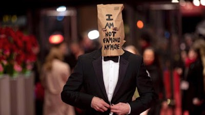

A single video camera hangs from a wall on 37th Street in New York, beaming live pictures around planet Earth, for anyone to see. It was activated last week and shall continue for the next four years. But what is the significance of this one shot; what is this little camera hoping to capture?

"He Will Not Divide Us" ([#hewillnotdivideus](http://www.hewillnotdivide.us/)) is the latest experimental social art project published under the name of anti-celebrity Shia Saide LaBeouf.

Yes, Shia LaBeouf. Once the uninteresting star of Michael Bay's TRANSFORMERS trilogy, now one of the weirdest and most unpredictable contemporary celebrities.

LaBeouf has been a strange fellow, neck deep in drama and run-ins with police for over a decade, but the turning point in the LaBeouf saga, in my view, was Rob Cantor's music video from a few years back about the "Actual Cannibal Shia LaBeouf".

<iframe allowfullscreen="" frameborder="0" height="315" src="https://www.youtube.com/embed/o0u4M6vppCI" width="560"></iframe>

From that point on, LaBeouf was no longer just a Hollywood performer, but also a man with a mythic aura. Shia surprise, indeed.

Then came his stunts, of which there are many. Most notable are probably [#ALLMYMOVIES](http://newhive.com/allmymovies) and I AM NOT FAMOUS ANYMORE.

Now comes Shia's latest, and most ambitious, livestream project. A four year long livestream in protest of the presidency of Donald Trump.

Wow. The guy does not disappoint.

Just like all of Shia's livestreams, [#HEWILLNOTDIVIDEUS](http://www.hewillnotdivide.us/) is weird. Really weird. In some ways it's difficult to see the point. And I can't help but wonder if it will cause more harm than good. Will this project against division in fact carve a deeper divide?

[... rest of the text continues in a similar format ...]

**UPDATE (12/02/17):** Welp, that didn't last long. [Shia LaBeouf's anti-Trump livestream has been shut down for public safety](https://www.engadget.com/2017/02/10/he-will-not-divide-us-livestream-shut-down/?sr_source=Facebook). Unsurprising, and sounds very fair, but it's hard not to be a little disappointed.

**UPDATE (21/02/17):** Aaaaand it's back. [Relocated to New Mexico](http://www.theverge.com/2017/2/18/14659164/he-will-not-divide-us-exhibit-el-rey-theater-albuquerque-shia-labeouf). Pretty close to a road. Think I just saw some people nearly get run down by a car. What is this.

**UPDATE (25/02/17):** Aaaaaaaaaaaaaand [it's gone again, after gunshots](http://www.pedestrian.tv/news/entertainment/shia-labeoufs-live-steam-shut-down-again-after-gun/da2b58cc-dd22-4795-bca5-8711e44bb5c6.htm).