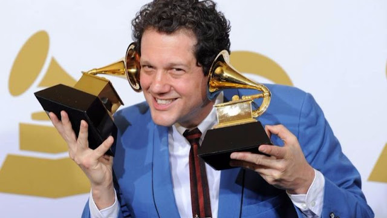

If, like me, you're a fan of film, TV or video game soundtracks, then [The Soundcast](http://thesoundcast.blogspot.com.au/) is one of the podcasts you should be listening to. Not just because it's a high quality show, or because [I appear on it as a guest from time to time](http://thesoundcast.blogspot.com.au/2015/03/episode-80-cue-awards-2014.html), or because it's one of the not-many soundtrack-related podcasts out there, but because regular hosts Christopher Coleman and Erik Woods frequently do a great job of discussing the state of scores and soundtracks in a broad sense. Their show stands out because they don't just debate whether *La La Land* is the worst thing ever or the best thing ever (one of the most over-discussed topics of recent months), but also attempt to dive into interesting, original and timely subjects such as *is modern Hollywood music "dumbed down"?* and *what actually makes a popular theme great?* They're interested by what it means to be a soundtrack fan, and how that meaning is ever-changing.

In their latest episode Chris and Erik discuss the concept of composer dominance. They cite John Williams and Hans Zimmer as dominant film composers of the past, and note that Michael Giacchino - through the abundance and prominence of his recent projects - is clearly next in line.

[Have a listen to the episode](http://thesoundcast.blogspot.com.au/2017/02/soundcast-stereo-ep-15-composer.html) for their discussion, including their thoughts on whether composer dominance is a bad thing (spoiler: they decide it probably isn't (sub-spoiler: I agree with them)). Here, I want to briefly jot down some thoughts I have about Michael Giacchino being the latest head honcho in the film music business.

If you had asked me five years ago: *hey Thomas, in five years who do you want to be the composer Hollywood uses for like everything?*, I probably would have mentioned Giacchino. If you'd asked me who I wanted to score *Star Wars* (other than Williams of course), same answer. Sure, Giacchino has his fair share of critics, but on the whole he is a champion for many classic film music fans. I mean, his music is clearly Williams-esque (even when he isn't charged with mimicking Williams - which, granted, happens fairly often), and who doesn't love (former Composer King) John Williams?

[... rest of the text continues in similar format ...]

**UPDATE (12/02/2017):** Wowzeedooza, [Soundcast Stereo did a response to my response](http://blog.tracksounds.com/2017/02/soundcast-stereo-listener-reaction-3.html). Response-ception.