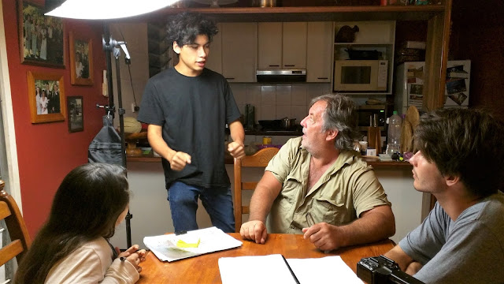
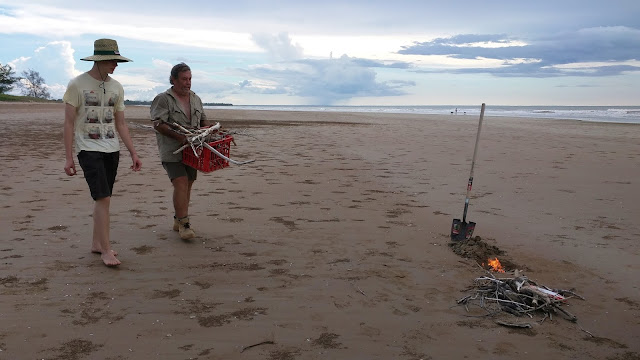
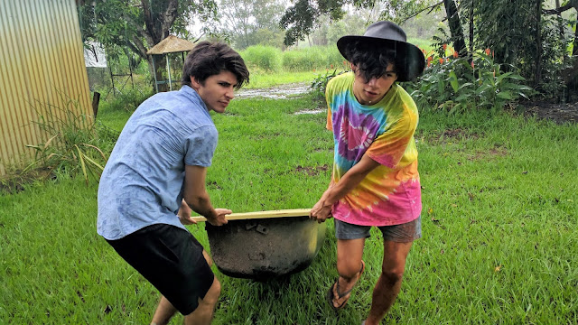

Over the past month I've been involved in the production of Nathaniel Kelly's first feature film, *The Adopted One* (working title). The crazy guy's made countless short films, and attempting a feature was the logical next step! The production was modest, and no-budget as ever, but for this film Nathaniel not only made good use of his regular stable of cast and crew, he also pulled in some extra special talent. Key example: Phil O'Brien.

*Nathaniel Kelly directs the leads: Journey Kelly, Phil O'Brien, and Joseph Baronio*

Phil's a great bloke, who has been involved in a lot of film production in the past. He really dived into his role as a father in *The Adopted One*. He's a natural in front of the camera, and I think his gravitas is going to shine in this role.

*Max Conaghan and Phil O'Brien on a beach*

Then there's some of the regulars behind the camera. Me. Max Conaghan. Max is really tall but he's still a great guy.

*Max Conaghan being a stand-in for a scene with Denis Franklin*

Feature films are long. This one was (mostly) shot over about two weeks. That's not normal. It was hard. Hard and fun.

*Joseph Baronio and Nathaniel Kelly dragging a bath through the rain*

Nathaniel hopes to finish the film this Winter, so look out for it!