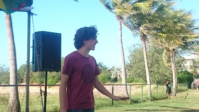
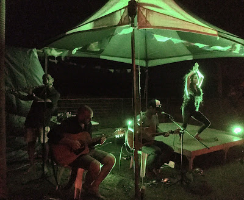

A few days ago the annual Seabreeze Festival was held at the Nightcliff foreshore in Darwin. This year my pimp Jennifer Dowling roped me into performing some monologues from the Spoken Word Stage, which she ran masterfully with a varied lineup of poets, singers and storytellers.

<table align="center" cellpadding="0" cellspacing="0" class="tr-caption-container" style="margin-left: auto; margin-right: auto; text-align: center;"><tbody>
<tr><td style="text-align: center;"></td></tr>
<tr><td class="tr-caption" style="text-align: center;">The canopy buckles under the strong breeze as honoured guest speaker Kate Holden shares some words</td></tr>
</tbody></table>

It was a lovely afternoon. Basically the Seabreeze Festival is just such a brilliant event. The weather's great this time of year, and the setting is superb; blue sky and blue ocean was our exotic backdrop.

<table align="center" cellpadding="0" cellspacing="0" class="tr-caption-container" style="margin-left: auto; margin-right: auto; text-align: center;"><tbody>
<tr><td style="text-align: center;"></td></tr>
<tr><td class="tr-caption" style="text-align: center;">The palm trees buckle under the strong breeze as myself says things</td></tr>
</tbody></table>

I mostly shared some monologues which I already had pretty much learned from previous projects, which were primarily by Shakespeare and Tom Stoppard.

<table align="center" cellpadding="0" cellspacing="0" class="tr-caption-container" style="margin-left: auto; margin-right: auto; text-align: center;"><tbody>
<tr><td style="text-align: center;"></td></tr>
<tr><td class="tr-caption" style="text-align: center;">The night concluded with an excellent excerpt from a show by Jazmine Productions</td></tr>
</tbody></table>

Cheers and congrats to JD and Samara Erlandson and everyone involved, good times.

