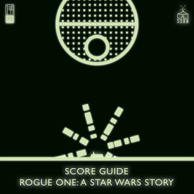

I'm an enormous fan of so many podcasts, and Sideshow Sound Radio is one of the big ones. One of their coolest projects is a series of "Score Guide" episodes, in which they present and discuss the entirity of a beloved soundtrack, including clever insights and a range of opinions. To make these episodes hosts Wendell Jones and William Dodson regularly seek contributions from listeners. So when I heard they were doing a new Score Guide on Michael Giacchino's fabulous Rogue One, I thought I'd better send something in.

The episode is out today, and it's excellent, and sure enough you can hear a little bit of me towards the end. <a href="https://sideshowsoundtheatre.com/2017/05/08/score-guide-rogue-one-a-star-wars-story-2016/">Here's a link to the show</a>.

I find these podcasts so enjoyable and relaxing; it feels like listening to a full album of superb music with other people who love it just as much as I do. Which is very special because honestly, how many people do you come across in everyday life who listen to film soundtracks every day?

Not many.

