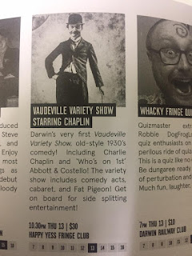
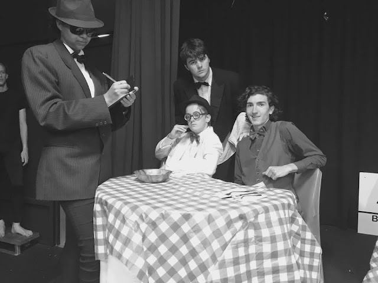

Here's the facts.

The Darwin Fringe Festival was a month ago. It was good. I got to perform in two shows. One of them was "VAUDEVILLE VARIETY STARRING CHAPLIN".

It was... well, it was what it sounds like. A madhat Vaudeville-inspired couple of hours of comedy, song, slapstick and skits. It was produced by an insane chap who I shall refer to simply as Russell "Rusty Rhubarb" Smith, and directed by a terrific gentleman called Tony Rive.

Russell "Rusty Rhubarb" Smith (shown above) was the centrepiece of the evening, singing and larking through a variety of comedy bits. One of these was a slapstick restaurant skit starring the titular, aforementioned and again shown above Charlie Chaplin, played by Russell "Rusty Rhubarb" Smith.

That photo displays a few other characters from the very same skit: (left to right) Haylee the gangster, Isaac the waiter, Damon the gangster, and me! I was the generically named "Male Lover". In this case referring to the facts that I was A) a lover and B) of the male gender, as opposed to my defining character feature being that I "love males".

This one's a snap from the night itself (thanks videographer Nathaniel Kelly!) in which Russell "Rusty Rhubarb" Smith and I can be seen performing the famous Abbott and Costello skit, *Who's on first*. Beast of a piece to learn, but it's mega funny.

Thanks to all of the wonderful cast and crew and brilliant musicians and everyone who came to see it. A great experience.