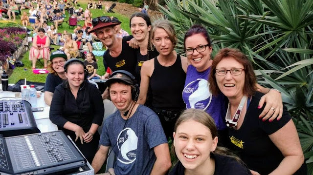
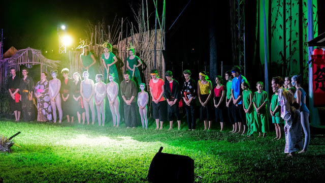

I loved Studio Ghibli's 2013 film, *The Tale of Princess Kaguya,* based on the ancient Japanese folktale, *The Tale of the Bamboo Cutter*. What a beautiful, honest and tragic—yet equally uplifting—fairytale about love and loss. And told with a particularly delicate minimalism which only Studio Ghibli can make sexy.

So when I heard local Darwin youth theatre company *Corrugated Iron* was putting on a new adaptation of the very same *Tale of the Bamboo Cutter*, I obviously got myself up in that hotness. **Bamboo Moon** was the title of the production, and it reshaped the classic story into a dynamic short live show.

It was put on as a free show with a three night run at the start of August. It was also staged outdoors in the wonderful dry season air, at the George Brown Botanic Gardens, and with excellent set design, props and costumes; it was a visually spectacular show.

That's a snap from a rehearsal. I played Haru, the son of the Emperor, a very important and pretty cool guy, whose only real flaw is that he enjoys a wee bit of violence and war. Doh! There also is Taylor who played the eponymous Princess Kaguya and Tahlia who was my guard and lieutenant.

There's me on the night. In character. Feeling things. Emotions. Drama. Acting.

That's some of the other actors being funny on stage. Don't worry, they were also in character.

As a dynamic outdoor youth performance, this show of course also included music, dance and circus! Look bamboo spirits on stilts!

And aerialist moon people!

Unfortunately there are far more wonderful images of all these people than I can include here, but you can have a look at [the show's photo gallery on the *Corrugated Iron* website](https://www.corrugatediron.org.au/bamboo-moon-gallery).

Finally I want to congratulate the dedicated crew, some of whom can be seen here...

...and the enormously friendly extended cast, some of whom can be seen here:

