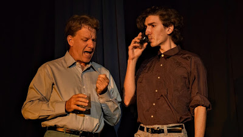
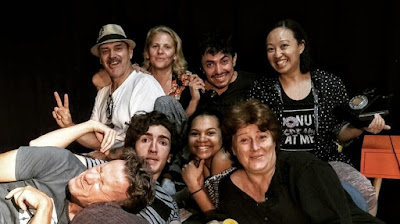

Last week I got to play an idiot called Trevor in Alan Ayckbourn's very-rather-British 70's comedy, *Bedroom Farce*. It's a very understated play featuring particularly unique staging: three beds. The characters move between these three separate beds/bedrooms throughout the play, which takes place over one night, getting twisted up in all kinds of hilarious (but again, very understated!) hi-jinx.

There's Malcolm (Andrew) talking to Trevor (me). He comes to hate Trevor by the end. Everyone hates Trevor. Trevor hates Trevor. Poor Trevor.

Sniffing a prop.

There's Kate (Lizzy), Malcolm (still Andrew), Susannah (Haylee), Trevor (me again) and the wonderful behind-the-scenes duo who made it all happen: Tony Rive and Tania Lieman.

And finally the full cast. Candid. Thanks for a fun time!