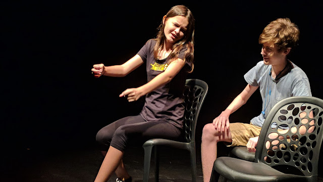

This week I attended a talk by Indonesian film director Garin Nugroho. One of the many things he talked about was a kind of theatre in which the actors rock up 30 minutes before the show and are given the story and characters there and then. There is extremely little preparation time, but the director briefly shares their plan, then the actors make the show.

This Corrugated Iron skit show, "Whiplash Theatre", has felt a little like that, as preparation time has been sparse. But like the theatre Garin Nugroho was talking about, it hasn't been a bad thing!

The show is a collection of disconnected scenes and skits, most of which centre around a bit of a "road safety" theme. I really enjoyed working with these two excellent young performers (above), who brought to life a really wacky skit.

That's a picture from a skit I appeared in myself, which included a video projection of me which keeps distracting the live actors who are trying to perform Shakespeare.

Final show (of three) tonight.

