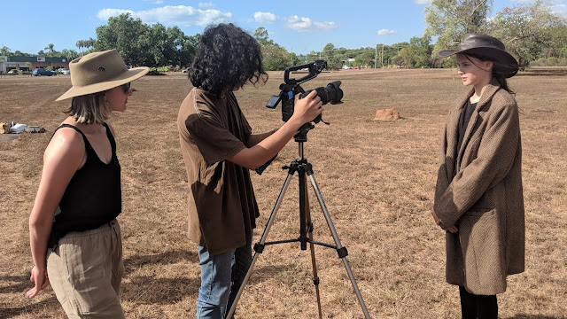
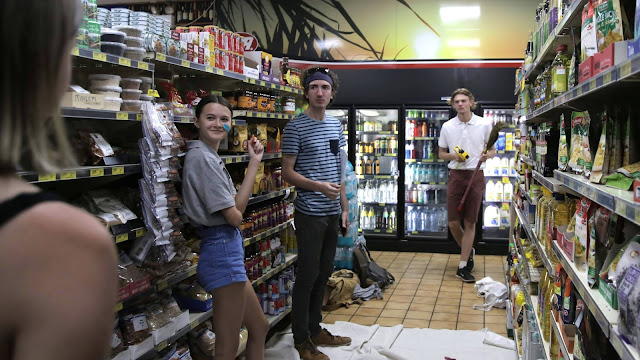

This year I was lucky enough to produce and co-direct one of the Darwin International Film Festival's five "Spark" films. These are five ten minute scripts that are picked to be produced over a short three months and screened as a part of the festival in September.

*It was a hoot having all these actual school kids play fake school kids in the film. The magic of cinema.*

I entered several project ideas into the program this year, and the one that was picked to be produced was "You Do You". This is a short film I've been thinking about, vaguely, since late last year. When I tried to write it earlier this year however, I found myself to be not very confident with the voice of the main character, a teenage girl. So I asked long-time collaborator Lexie Gregory to write it for me.

*Here's Lexie herself, with DOP Nathaniel Kelly and star Koko Lawton*

Turns out that was a great decision. Because what Lexie wrote was quite unlike my original plans, and quite unlike the films I've made before, but felt genuine and personal. The story is a little more honest than the stories I usually write myself. I was very excited to work on something that wasn't my usual speed though. This experience was unique. The first time I've directed a film I didn't write myself, too!

*Koko, me, and hey look it's Max Conaghan*

Anyway, we shot the film in July. Worked with a bunch of lovely people. Shooting had its many challenges, as shooting always does. We had to be pretty disciplined about schedules because most of the crew currently resides interstate and were only in Darwin for a couple of weeks. There were some difficult times but overall it was actually one of the smoothest shoots I've been involved with. Co-directing with Lexie was lovely not least because it took some of that crazy pressure off my shoulders.

*Koko, Joseph Baronio (beautiful producer), Nathaniel, Johanna Hayes (beautiful assistant producer) and Lexie*

Additional shout-outs to Joseph Baronio and Johanna Hayes for being good producers. Oh man don't you just love producers? Also Koko Lawton, who starred as the character Mickey. Koko *is* You Do You. If You Do You is anything it is because of Koko. The boppin' soundtrack is by my favourite music-wizards, Natalie Gall and Thomas Field.

You Do You, and the four other DIFF Spark films, will be screening this Friday evening at the Deckchair Cinema. Nervous-excited to see what people think of what we've made!

In the meantime, here's the trailer:

<iframe allow="autoplay; encrypted-media" allowfullscreen="" frameborder="0" height="315" src="https://www.youtube.com/embed/dirOQQVYbyE" width="560"></iframe>

