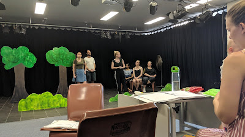

In November and December 2018 I was ecstatic to be given the opportunity to act in two bright, lively and hilarious plays. Both were directed by Tony Rive and presented in Darwin's Browns Mart Theatre.

First came Darwin Theatre Company's Black Comedy, a tight and fast piece of British absurdity with some really fun physical gags:

Then came Corrugated Iron's production of Love's Labour's Lost, a strange little Shakespeare, which was presented at Browns Mart alongside an excellent production of Animal Farm.

I was also honoured to be given the opportunity to create the television advertisement for Corrugated Iron's shows, which you can view here:

[Animal Farm and Love's Labour's Lost TVC](https://vimeo.com/300628614) from [Corrugated Iron Youth Arts](https://vimeo.com/corroiron) on [Vimeo](https://vimeo.com/)

Unreal amounts of fun making these shows with so many cool people.