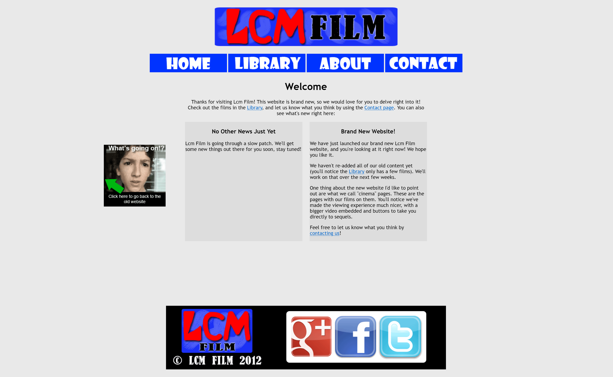

Smells pretty good right?

Actually yeah, don't sniff too hard. Knowing how I've thrown it together, this website probably has errant links that take you directly to my bank account or something.

I've had many personal websites over the years. Making them is something that I've always been very interested in and only mildly good at. Putting them together feels like its slightly beyond my skills, slightly beyond what I'm capable of – which is the most fun space to play!

Some of the earliest sites I remember putting together used *Freewebs*. Which later changed its name to Webs, and later [shut down completely, apparently deleting everything](https://www.reddit.com/r/DataHoarder/comments/l2jzib/webscom_aka_freewebscom_deleting_tens_of_millions/).

My early websites featured my projects under the moniker "Lcm Film". Here's one of the final forms of that Freewebs site (which went through a ridiculous number of regenerations... every few months I was like "Let's remake the website!").

Not much as changed, has it? Get rid of the dated Google+ link and the ear-searingly grey background, and this website could pretty much do the trick for me today. Actually, now that I think about it, I don't know why I've spent so much time on the new site. Could've just re-published this one!

It's even got a "Brand New Website!" blurb there, just like the one I'm writing right now.

But if you look closely, my favourite bit is the little "What's going on!?" image on the left, with a link to go back to the previous version of the website. How thoughtful of me.

My websites were actually much more fancy back then. I mean, each of those menu links lights up when you hover over them. I put functions like that together manually, designing lit-up versions of each image and programming the hover effect. And the Library has links to separate pages for each short film I was hosting at the time. Yes, actually hosting. Videos weren't all just hosted on YouTube back then, like they are now (for better and worse).

My websites went through quite a few different stages after that...

This is what it looked like when I was just starting to get into minimalism.

Now I was using my own name, a picture of myself, and starting to base everything around my YouTube Channel. Exciting times.

Later on I had this site. Which again, in hindsight I'm pretty impressed by, and I wonder why I got rid of it. It's pretty elegant for 2016.

I can't take all the credit for this one though. It was created with help from my mate [Drew Collins](http://drewcollins.me/). Who was and I have to assume absolutely still is an absolute legend.

But according to the laws of balance, after this relatively minimalistic phase, I went a bit loopy...

For a little while I had a website that looked like this. Holey moley. We all go through design phases.

Since then and in-between I've had various other sites, hosted with Blogger, Squarespace, Wordpress, Drupal, and I think at one point in my teens I lost my mind and went pure CSS. Or went pure CSS and lost my mind. It's a chicken and egg situation.

Then there's the website I've had for the last few years. A very basic Wordpress page.

I was determined to go proper minimal with that one. No icons, only a few lines of text, one image. And I think it has served me well.

But I've been wanting for something a little more robust. A little cleaner. A little better at communicating everything I'm up to. And with a blog built in, so that I can write *stuff like this*!

Which brings me to the new website.

First up was choosing a platform to build with. I don't like Wordpress, it's a clunky mess to me. I wanted to find something that was

- open source,
- modern and widely-used,
- affordable (or free)
- and highly customisable.

It didn't take long to discover that there are more great options out there than ever.

I could use something like [Publii](https://getpublii.com/). It's got everything I want, and even has an easy to use GUI. But after trying it for a little while, I quickly realised that unless there was a template that I really liked, it was going to be frustrating to customise.

So I started looking at others: Ghost, Hugo, Zola, Eleventy. So many good options!

But ultimately, it came down to the availability of templates. Even though I intend to customise a lot, I wanted a very solid base to get started.

And so, in the end, this new website is built on Astro. Which ticks all the right boxes, in terms of being modern and open source. It also appears to be very popular.

Plus, I really love [this template by Muhammad Syakirurohman](https://github.com/devaradise/devolio). It's clean and elegant, putting projects and blog posts at the forefront. And since it's built on Astro, the potential for customisation is unending.

It's also a great boon that platforms like Astro integrate beautifully with markdown files. I've been using [Obsidian](https://obsidian.md/) a lot over the past year for extensive note-taking, and being able to write blog posts the same way is very intuitive.

The tricky part is, of course, learning Astro.

Coding is something I've always dabbled in but never really become proficient at. So it's only with the help of language model chat bots like ChatGPT and (most helpfully of all) Claude that I've been able to stuck into designing this website.

But as helpful as AI bots are for getting started on something you don't understand, it sucks to rely on them too much for too long. After a while, you want to ditch the training wheels and fly on your own, ya know.

So that's the journey I have ahead of me! And that's what makes it fun! Sure, I could fork out however much money each month for Squarespace and have a great website in minutes (or so all the podcast ads tell me). But then I wouldn't feel like I am *truly* the master of the website. This way, as long as I don't absolutely tank the code into a scorching mess, nothing is holding me back. 

For me, one of the key themes of 2024 has been not getting locked in. Not getting locked into a bad habit, or a particular way of thinking, or a single digital app or service. I've done enough of that in the past.

So that's it, that's my new site, and this has been the first blog post.

With the internet becoming *even more* fragmented all the time, it's wonderful to have my own independent space to bring together everything that relates to me.

And hey, if you do find a link to my bank account... eh, you're welcome to whatever's there.