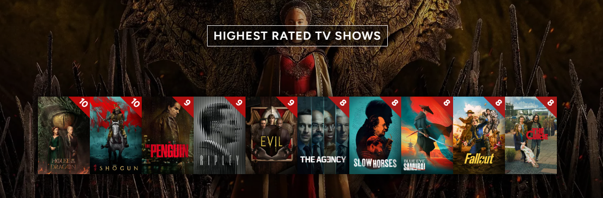

Like most humans, I just can't get enough stories in my life. 
## TV Shows

2024 was a great year for TV. My top 10 has quite a range of things I loved.

At the bottom is **The Curse**, which was divisive but completely enthralled me. And it proved that I don't only love Nathan Fielder for his provocative reality TV satire, but also for his fiction! And bloody hell, Emma Stone is good. I know the finale didn't work for a lot of people, but I think about it a lot.

Then there's **Fallout** and **Blue Eye Samurai**, colourful genre shows that are widely acclaimed and I can see why.

Then we've got the shows that brought me deep into the spy game. I caught up on all of **Slow Horses** in 2024, and I'm now a massive fan. I thought the 2nd season in particular was just delightful. The latest season was probably the weakest, but still a lot of fun. I hadn't yet finished **The Agency** when I scored it 8/10, but I was so enjoying the early episodes that it felt like an easy call to make. Honourable mention for **Black Doves**, which must have just missed my top 10.

**Evil** had its series finale in 2024, and it's really sad to say goodbye to that show. You know when you feel like something is made *just for you*? For me, that was Evil. I've loved many TV Shows by [the Kings](https://www.newyorker.com/magazine/2022/06/20/the-couple-behind-tvs-boldest-shows), but this was my favourite. It had all the cleverness of The Good Wife, all the genre thrills of BrainDead, all the contemporary relevance of The Good Fight, and it was about angels and demons! I had an absolute hoot, it's one of my favourite shows ever.

I had a good time following the horrible exploits of sociopathic narcissists in **RIPLEY** and **The Penguin**. Both walked that line of making the horrible protagonists likeable enough that it was never a pain to hang out with them. But hey, when you have Andrew Scott and Colin Farrell, that's not too hard.

Then at the top of the list, the shows I enjoyed most in 2024, we have **Shogun** and **House of the Dragon** Season 2. Both thoughtful, character-focused examinations of pre-war tensions. Both had the best performances I saw all year. And particular props to Shogun for such a thrilling use of language and translation.

There were also some new seasons I absolutely loved, like **The Rings of Power**'s second outing. I couldn't get it to show up on my Trakt list above because, well, sometimes Trakt is weird. Speaking of which...
## Movies

I'd already seen the first **Dune** and **Gladiator**, but I rewatched them in 2024 and rated them on Trakt, so they've appeared in this list. And there doesn't appear to be a way to remove them. Ah well.

These rewatches reminded me that the first Dune and the first Gladiator are both *awesome*. Actually, they have a lot in common. Desert-based action adventure epics about rising up against villainous emperors. Both incredibly entertaining and rewarding upon rewatch. Both featuring some of Hans Zimmer's most iconic work.

They diverge in their sequels, however. **Gladiator II** was really not bad, I thought. A decent ride, maybe a bit too much of a re-tread, but an entirely competent sequel. On the other hand, **Dune: Part Two** was one of my favourite films of 2024, and the more I've thought about it, pretty much a masterpiece.

**The Remarkable Life of Ibelin** was also high on my list. A tragic, uplifting documentary about illness and community. The way it depicts found family in World of Warcraft really, really, really worked for me.

I caught **Anatomy of a Fall** at the very start of the year, and it was one of my most thrilling cinematic experiences in recent memory. Astoundingly engaging courtroom drama. And like Shogun, the way it uses different languages to convey interesting things about the characters is something I'm so fascinated by.

I knew nothing about **Wicked** before seeing this movie, and like so many others I got completely swept up in it and I can't wait for part two!

**Caddo Lake** came out of nowhere, it's such a cool little drama with a twist. I don't want to say anything about the plot, it's wonderful to learn all about it in real-time. Highly recommended!

Perhaps it has something to do with the mood I was in on the day, but **Twisters** is the most fun I had at the cinema in 2024. There's nothing too surprising about the movie, but the cast is so loveable and I was completely along for the ride.

**Challengers** is a thrill ride and a half. I was so delighted by the propulsive, twisting and turning games of passion and ambition. Shakespearean and all that.

And finally, **The Last Stop at Yuma County**. On the face of it, it appears like a pretty generic Coen Brothers rip-off. But it's so much better than that. It makes a completely absurd situation feel immediate and true and quickly becomes one of the most shocking, terrifying, hilarious rides of the year. And it doesn't just fall apart into a mindless shootout at the end! So good.
## Books

I have huge appreciation for the power of reading books and listening to audiobooks and (like many people) I'm trying to increase my reading each year. I didn't quite make it to my 24 book goal in 2024, but I'm optimistic about my 25 book goal for 2025!

I'll highlight three books I read in 2024. Not necessarily my favourites, but worth a mention:

- **Kill Your Husbands by Jack Heath**
This is a proper page-turning mystery that I consumed within a few short days. It has so many twists and turns -- every time I started to worry I'd figured out all of the mysteries, there was still more to come. And it leaned further into horror than I'd anticipated... gave me some shivers before bed! For pure entertainment, this may have been my favourite thing I read this year.

- **Edgedancer by Brandon Sanderson**
I didn't love this, but I was tickled by some of the ideas. It's a breezy little novella in Sanderson's *Stormlight Archive*, which I find myself somewhat begrudgingly committed to (once you've read 4 books in a series, how can you stop!). There are few things as painful as spending too much time with a character who's supposed to be constantly witty (think Steven Moffat protagonists), but hey, sometimes Lift is genuinely witty and that makes it worth it (again, think Steven Moffat protagonists).

- **Doctor Who: Scratchman by Tom Baker**
A messy Doctor Who adventure, with a severe lack of stakes and any character development. However, this is still a brilliant ode to Tom Baker, particularly when listening to the audiobook read by the man himself. His winks and laughs and sighs through the story in that way that only Tom Baker can. And more than anything in the story himself, his reading of "a letter from Sarah Jane" at the end was extremely endearing.
## Music

I listened to a LOT of music in 2024. I'm a soundtrack fiend and here's a little Last.fm overview of the things I was into:

Giacchino, McCreary and Williams being my top three composers makes a lot of sense. They've been up there for a long time and will probably stay there for the rest of my life.

As you can tell from my top albums and tracks, I got deep into some video game scores this year. Later this week I'll be posting my annual *Favourite Soundtracks of 2024* video, so I won't discuss any of these here, but those Last.fm stats might give you a little teaser...

All in all, it's been such a really great year across popular media. And considering the sheer quantity of huge things that are coming soon, things aren't gonna be slowing down in 2025!