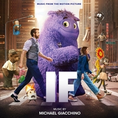
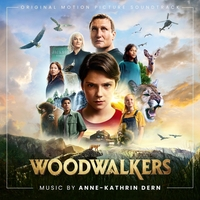
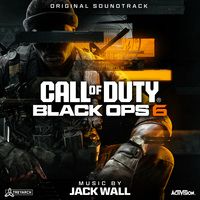
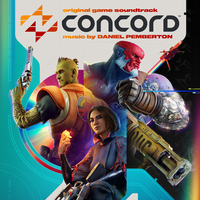
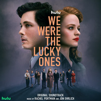
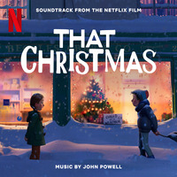
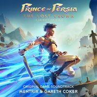
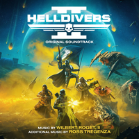
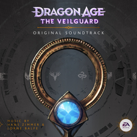
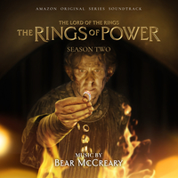

# My Top 24 Original Scores of 2024

For the 5th year in a row, I've created a list of my favourite soundtrack music of the year. This year I present my **24** top original scores released in the year 2024.

    <iframe width="560" height="315" src="https://www.youtube.com/embed/ujTxANp-6FA?si=7YNg_xTN2kIV7kzm" title="YouTube video player" frameborder="0" allow="accelerometer; autoplay; clipboard-write; encrypted-media; gyroscope; picture-in-picture; web-share" referrerpolicy="strict-origin-when-cross-origin" allowfullscreen></iframe>

The video above presents this list with short clips from each score, but below you can find my list in written form.

---

## 24. **IF** – Michael Giacchino

Well, it's a colourful and delightful Michael Giacchino score! He's very much in his Pixar mode here; cutesy melodies with playful instrumentation, whistling and upbeat.

It never really gets very complicated or intricate, but it's very pleasant and in places effectively touching and nostalgic. The only downside is that on album it struggles to really get going. There are great statements of themes, but even on the suite tracks they somehow struggle to take off into a really satisfying cue.

That said, beautiful short statements are better than no statements at all!

---

## 23. **RED ROOMS** – Dominique Plante

The highlight of this score is this courtly sort of baroque canon, lulling us into a sense of security and order. It sounds like progress, but underneath there's certainly a sense of irony, of farce.

In other places, this film score also features some strange, twisted material with modulating strings and trance-inducing percussion. Plus some distorted screams in places, to make sure you're really discomforted.

It's a memorable score for a disturbing film.

---

## 22. **THE DRY 2: FORCE OF NATURE** – Peter Raeburn

This is a surprisingly sweet and tender score that—actually, no, the sweetness and tenderness wasn't the surprising part about _The Dry 2_ . What surprised me is how epic and sweeping it can get.

The relatively contained mystery movie here didn't necessarily beg for such scope, but this music leans into a heightened sense of melodrama in a way that I absolutely love.

I'm also delighted to have something Australian on the list this year. Rare for me!

---

## 21. **WOODWALKERS** – Anne-Kathrin Dern

Anne-Kathrin Dern has been on my radar since *The Devil Conspiracy*, and this was my favourite score of hers I heard in 2024.

She's done well here working with a film that was clearly using temp tracks from things like _Pirates of the Caribbean_ and maybe some other Remote Control scores. And when I hear something that's clearly following a temp, emulating the pattern of a cue I'm much more familiar with, I become very interested in how this composer has made their music different.

And even in those temp-y places, _Woodwalkers_ is plenty original. Its main themes are full and rich, blanketing the whole score in magic. I love the warm, heavy strings.

All in all, _Woodwalkers_ is rather wondrous and wonderful.

---

## 20. **THE PENGUIN** – Mick Giacchino

We had Michael Giacchino, now let's have his son, Mick.

There isn't a massive orchestra on this score, but the instruments sound so good. Mick Giacchino is clearly benefiting from some family expertise in giving character to the orchestra.

But yeah, this is deliberately more intimate and smaller in scale than *The Batman*, though it continues many of the same musical ideas. Disturbing psycho-esque strings, for example, are used to great effect.

The main motif for _The Penguin_ is a simple little two-note riff, like Hans Zimmer's Batman theme. It's an instantly iconic identifier.

And it all culminates in a really wonderful frantic, chaotic, powerful main theme.

---

## 19. **WICKED** – John Powell and Stephen Schwartz

This is an interesting one, because since it's a musical we kind of need to clarify: am I talking about the score, or the songs, or both?

Well, I'm here doing this because I'm primarily a fan of orchestral music, so that's where my focus is. And John Powell and Stephen Schwartz have made a really luscious colourful score in that regard. It has really wonderful moments of incredibly detailed expansive composition—some of the most beautiful _moments_ in a score this year.

The only thing that doesn't let it reach really great heights, in my opinion, is the fact that it's clearly connected to a musical. So anytime the orchestral score feels like it's building to something... it doesn't quite get there, because it's been building to a song, which is over on the other soundtrack.

That handicaps it a little bit. But still, some of these tracks are pure magic.

---

## 18. **CALL OF DUTY: BLACK OPS 6** – Jack Wall

I'm still pretty new to being a fan of the music of this series, but a couple years ago Bear McCreary's _Call of Duty_ was my favourite score of the whole year, so I'm pretty on board for each new release.

And _Black Ops 6_ by Jack Wall reminded me in some ways of how entertaining I found that Bear McCreary one. This is a big and propulsive score... lots of musical ideas, really energetic and pulse-pounding.

Occasionally that becomes too much, a bit of a Wall of sound (so to speak), but throughout the album there are points where I think that mix is just right, and it feels like a big action blockbuster.

---

## 17. **CONCORD** – Daniel Pemberton

Now to a much less popular game, to say the least. A game that failed so spectacularly you can't even play it anymore.

Thankfully, we get to keep Daniel Pemberton's score, which is super charming and energetic. It sort of does the _Overwatch_ thing, of having contemporary rhythms and some classical heroic motifs on top, but I'd say _Concord_ actually leans a little more cool and modern compared to *Overwatch*'s sometimes kooky retro style.

Either way, it's certainly good at hyping me up.

---
## 16. **WE WERE THE LUCKY ONES** – Rachel Portman & Jon Ehrlich

Nothing like a bit of Rachel Portman to tug on your heartstrings. Here with Jon Ehrlich too, we have a classy drama score that I really enjoyed, especially when it goes big.

When it soars, it's really something. When that main theme kicks in, your heart explodes. That's just Rachel Portman, that's how it works.

---

## 15. **THAT CHRISTMAS** – John Powell

Putting this above _Wicked_ is probably a little controversial, but for me, _That Christmas_ was the John Powell music that most delighted me this year.

It's whimsical and Christmas-y and gets just as playful as any of the best John Powell scores from over the years. It's yet another reminder, as if we needed it, of just how agile John Powell's writing can be, with cues that jump from idea to idea without ever feeling too busy or directionless.

I mean, as all John Powell fans know very well, when it comes to melody and leitmotif, he's one of the best in the business.

---

## 14. **ARK: THE ANIMATED SERIES** – Gareth Coker

Gareth Coker has created a lot of music for the _ARK_ series of games over the years, but now here he is doing a score to an _ARK_ animated series.

He's brought over many of his great existing themes, and he continues to flesh out this bombastic soundscape. I just find all of the music in this series so listenable.

And to contrast with the bombast, there's some really delicate, gentle, romantic material in here too, which surprised me a bit.

Technically this release is labelled as Volume 1, but I don't believe there's been a Volume 2... yet? Which is fine. This release is uh... over 3 hours long. There's so much to enjoy.

---

## 13. **FINAL FANTASY VII REBIRTH** – Various Artists

This is one of those soundtracks that's kind of impossible to summarise. It is many hours of music. Not all of it is great, and a lot of it is in styles of music I don't really enjoy.

But so much more of it is great than needs to be, and some of it is out of this world.

Of course, as a re-imagining of *Final Fantasy VII*, this sees the return and reinvigoration of some of the greatest themes in the history of video games. Many of the reiterations are beautiful beyond words.

My only worry is finding the time to listen properly to all of it!

---

## 12. **PRINCE OF PERSIA: THE LOST CROWN** – Mentrix & Gareth Coker

_Prince of Persia!_

This game score has a little bit of _Hades_ about it, with some electrifying high-tempo beats. It's got some really cool tracks, and when it comes to the main theme, which is my favourite part of the soundtrack, its presentation can be so huge and enormous, like the example you've just heard.

I didn't expect _Prince of Persia_ to sound like *ARK*, but thanks to Gareth Coker, that's sometimes the case.

_Prince of Persia_ is higher than _ARK_ on my list because overall I just found it to be a newer and fresher experience in 2024.

---

## 11. **MASTERS OF THE AIR** – Blake Neely

Blake Neely has big shoes to fill in this follow-up to _Band of Brothers_ and *The Pacific*. And I think he really pulls it off.

This is exactly the sort of sentimental World War II soundtrack that I was hoping for. It combines some gloriously wistful, patriotic sop with some really tense and exciting action cues.

It's really what it says on the tin, and that's a great thing.

---

## 10. **HOUSE OF THE DRAGON SEASON 2** – Ramin Djawadi

A dark and brooding score here for a season of _House of the Dragon_ that's all about the inevitable escalation of war.

And there's actually a recurring motif that exactly represents that theme, sometimes in the form of this foreboding wailing female vocal. It's really raw and tragic.

A lot of this soundtrack is quite bleak, similar to previous Ramin Djawadi _Game of Thrones_ music, but it's still full of standout pieces of beautiful montage and intense action.

---

## 9. **TALES OF KENZERA: ZAU** – Nainita Desai

This one came out of nowhere for me. I'm not familiar with the game or the composer.

It's really exciting though. Brilliant musical storytelling—you don't need anything but the music to start seeing vivid images. There are clearly a lot of inspirations here, but what immediately jumped out to me is some very big Ludwig Goransson _Black Panther_ inspiration, particularly on a couple of action cues.

But hey, again, being able to see a clear line between this and its inspirations doesn't negatively impact my enjoyment in the least.

This is just a gorgeous and vibrant soundtrack.

---

## 8. **TRANSFORMERS ONE** – Brian Tyler

I never thought a spiritual sequel to Brian Tyler's _Transformers Prime_ soundtrack from 2012 is something we'd get. But here it is. Brian Tyler even references those great old themes!

Anyway, even if you don't already love the music of *Transformers Prime*, _Transformers One_ is so great.

Brian Tyler gives the Transformers such profound nobility in his iconic long-winded melodies. There are few things that I love more than a big melodic Brian Tyler blockbuster score, and this really is another good one.

Some really, really big heavy brass here too, and that always gets me.

---

## 7. **YOUNG WOMAN AND THE SEA** – Amelia Warner

Between _Transformers One_ and *Young Woman and the Sea*, this is definitely the most uplifting, inspirational section of my list.

This score is really wonderful, magical and beautiful. It's got a bit of Enya DNA in there, and there aren't many 2024 scores I can say that about.

In a couple of brief little moments, the orchestration even reminded me of Justin Hurwitz' *First Man*, and that's just an all-timer for me.

Anyway, solidly entertaining album, end to end. It only gets better with each listen, and that's why it's this high on my list.

---

## 6. **DUNE: PART TWO** – Hans Zimmer

It's funny, these days Zimmer's presence is felt so keenly across the board, on film scores he had no direct hand in, so it feels strange to actually come to one that's got his name on the cover.

And the thing is, and what's clear in *Dune Part Two* , is that the Hans Zimmer of today is quite different to the Hans Zimmer we've heard in the past.

He uses many of the same elements and techniques, but _Dune_ is much more minimalistic and experiential than a lot of his most famous scores.

We know from interviews how passionate he is about this particular story, and how personal the experience of creating this music is for him. And that really comes through in the music.

It's full of so much feeling, saying so much with, at times, so little.

The piece you just heard is for me the most heartbreaking piece of the year. Zimmer's _Dune: Part Two_ may not be eligible for an Oscar, but it's eligible to be high on my list.

---

## 5. **HELLDIVERS 2** – Wilbert Roget, II; Ross Tregenza

_Helldivers_ is mad fun! Talk about _Starship Troopers_ on steroids.

It's an upbeat, rousing action blockbuster, with a cheeky sense of irony that never gets in the way of just being FUN.

Murray Gold once talked about comedic music, and that tough balance of knowing when to lean into the comedy, and when to play it straight.

Well, for the most part, Wilbert Roget II plays this perfectly straight, and I think that's the right approach. He gives himself full permission to lean into the naïve capitalistic heroism.

This album is on the shorter side of things, but it's just some of the most fist-pumping fun I've heard all year.

---

## 4. **WORLD OF WARCRAFT: THE WAR WITHIN** – Various Artists

If you know much about my musical tastes, you know I can never get enough _Warcraft_ in my ears.

It's just one of the great musical landscapes, inspired by all of the greatest epic fantasy music of decades past, and taking it in bold new directions.

And after a couple of slightly disappointing soundtrack releases, I think _The War Within_ is a return to form for the series. It's packed full of new ideas, and it's beautifully recorded.

I listened to this album on repeat for a couple of months in 2024, and it helped me get through some challenging work. I find that music with this much character, magic, and heart is just a perfect companion through difficult times.

---

## 3. **STAR WARS OUTLAWS** – Wilbert Roget, II; Kazuma Jinnouchi; Jon Everist

Yep, it's another game score by Wilbert Roget II!

I'm obviously a sucker for some _Star Wars_ music, but its combination with contemporary styles in recent years has been hit and miss.

I'm not one of the people who thinks _Star Wars_ always needs to sound like John Williams, but I do think many attempts to leave that classical romantic style behind have been fairly disappointing.

Here however, I think they found a great balance. _Star Wars Outlaws_ references some Williams themes, surprisingly appropriately, like its use of the Imperial theme from *A New Hope* . But for the most part, it's original and exciting, taking us into new areas of the _Star Wars_ universe.

I think one thing it does so well is keeping a sound that's a little unusual, a little alien, a little not of our world. That allows the composers to incorporate modern elements without it losing all of the *Star Wars-y-ness* .

Basically, it's so cool.

---

## 2. **DRAGON AGE: THE VEILGUARD** – Hans Zimmer & Lorne Balfe

And _another_ game score!

It's a little surprising to have the new _Dragon Age_ this high on the list. I mean, the series has always had great music, particularly *Inquisition*. But I liked this entry by Hans Zimmer and Lorne Balfe (well, let's be real, mostly Lorne Balfe) way more than I anticipated.

And in terms of measuring a score by how much fun I've had with it, how much enjoyment I've gotten out of it—well, from that perspective, _Dragon Age: The Veilguard_ deserves to be here at number 2.

The main title theme, which is heaps of fun, and probably where Zimmer's influence is most prominent, actually sounds a lot like Junkie XL. And not in a bad way. It's like Junkie XL's _Batman_ or *Mortal Engines*. It's pretty over-the-top.

There are a lot of recognisable modes of Lorne Balfe here... some _His Dark Materials_ in the thematic shapes, a bit of _Mission Impossible_ grandiosity, and a whole lot of *Skylanders*. This really is basically _Skylanders_ with a bigger, darker sound.

And overall, it's much more upbeat than I'd expect from *Dragon Age*. In the end, this score just has a whole lot of tracks that I really really enjoyed. Many times, on repeat. And I was thoroughly entertained.

---

## 1. **RINGS OF POWER SEASON 2** – Bear McCreary

It almost feels like a cop out. I tried to find anything that could knock this off the number one spot, but I couldn't. For me, _The Rings of Power_ is just head and shoulders above everything else out there.

The scores for the first season blew everything else away. Some come-down was to be expected in this follow-up, and yes, it re-treads a lot of the same territory, which isn't quite as novel this time around.

But the leitmotif writing on this is still just so good, and it's full of wondrous new ideas, like the powerful theme for Rhûn and the delicate sounds of Eregion. Meanwhile, themes from the previous season are refreshed with some of their best presentations yet.

It's so good, and just like last time, there's so much of it.

In terms of strong themes, great orchestration, and satisfying cohesive cues, _Rings of Power_ continues to be my favourite music of recent years.

---

## Wrapping Up

Phew! There we are, another year of this down!

As usual, I feel bad about all the things I couldn't fit on the list. 

I haven't even put on the _Lord of the Rings_ movie, or the _Indiana Jones_ game, or the _Gladiator_ sequel. There were about half a dozen scores that during the year I felt super sure would be on the list, so I even wrote up a little blurb about them for this video. But they ended up not fitting.

There was a pretty even split across categories this year—I had 6 TV shows, 9 movies, and 9 video games. But the top of the list leaned heavily into the video games. I guess that's largely where I found the most musical entertainment this year.

Movies were down big-time from last year, when I had 14 film scores. And only one score on my list this year was nominated at the Academy Awards—*Wicked*. Though that's not unusual, I can't remember ever really agreeing with the Oscar picks.

Only a couple of double-up composers this time around... having John Powell twice isn't surprising. Wilbert Roget II at spots 3 and 5 is a little. Hans Zimmer's name is there twice, on _Dune_ and *Dragon Age*, but really I do think of _Dragon Age_ as a Lorne Balfe score.

I always love to see the surprises that come out of nowhere for me each year. Like, I had never heard of _Tales of Kenzera_ until a couple months ago, and even now I know nothing about it except that I like the music. It's so much fun to expand the pool of things you love.

See you next year!