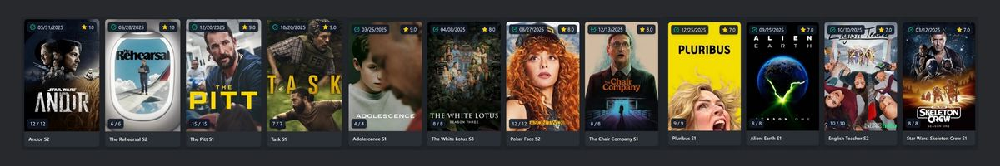
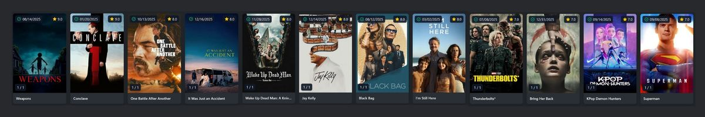
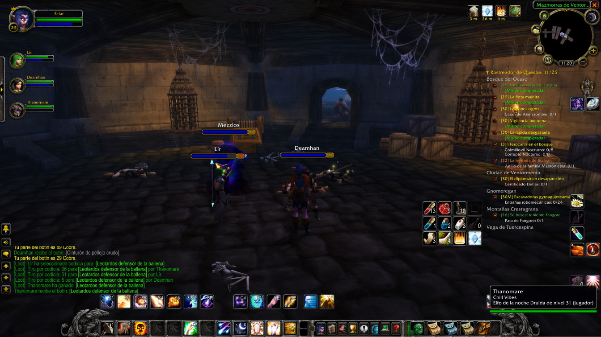
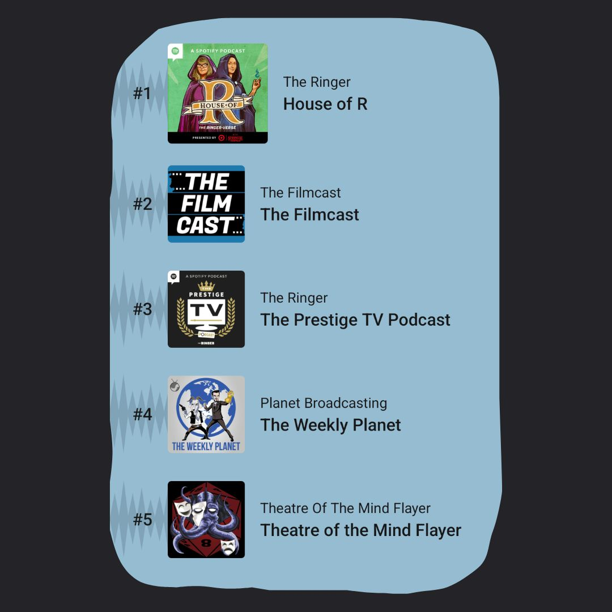

2025 has come and gone. Another year made so much better by great stories. And the only thing better than watching, reading, listening to and playing... is sharing those experiences with other human beings. So here we go!
## TV Shows

Of all the mediums, in my opinion TV continues to feature the most stand-out original art.

My top picks are book-ended by Star Wars: **Skeleton Crew** was some of the most adventurous fun I had all year (Jude Law is a perfect Long John Silver), and **Andor** Season 2 used a galaxy far, far away as the backdrop to a riveting rise against fascism.

The sci-fi thrills continued in **Pluribus** and **Alien: Earth**, both of which hooked me at the start and maybe lost a little bit of my attention by the end. Really hoping to see them both return of second seasons before too long.

A strong year for clever comedies between **English Teacher** Season 2 (uncomplicated laughs), **The Chair Company** (complicated laughs) and **The Rehearsa**l Season 2 (extremely complicated laughs). I've loved all of Nathan Fielder's work, but I really think this season of The Rehearsal was his greatest work yet.

The second season of **Poker Face** was a complete delight, and ended in a really exciting way. I'm sad to hear a third season isn't a surety at this point, because there really isn't much on TV quite like this.

Finally, the dramas. The latest trip to **The White Lotus** may have been my favourite yet, thanks to a really incredible ensemble of some of the most excruciating characters imaginable. **Adolescence** has been talked to death, and with good reason, it wowed me and broke me simultaneously; my heart saying "this is unbearable" while my brain said "what the heck how did they pull this off". **Task** was a perfect short HBO drama with incredible performances and an interest in revealing radical kindness within dire circumstances. Then there's **The Pitt**, an addicting adrenaline ride that proves truly long-form TV isn't dead quite yet!
## Movies

I don't feel like I loved heaps of movies that I saw this year. Not compared to other recent years. Still, there were enough to make a great top ten.

A decent year for superhero movies. **Superman** was essentially everything I wanted it to be. Perhaps not as neat and tidy a movie as it could have been, but its heart was in the right place. The same could be said for **Thunderbolts**, which somehow defied the constraints of the Marvel machine to tell an intimate story about small-scale struggles.

**I'm Still Here** and **It Was Just an Accident** were such difficult, challenging films. Very uncomfortable very important stories. **Black Bag** was Soderbergh at his best: slick, smart and agile.

I really enjoyed the deft handling of religious themes in **Conclave** and **Wake Up Dead Man**. These are films that could have easily taken cheap shots in many different directions, but neither takes the easy path. They sit with difficulty, but it doesn't ever feel like a burden to watch. That's good writing.

**Jay Kelly** surprised me as a really tender and charming glimpse into aspects of Hollywood. **One Battle After Another** is probably Paul Thomas Anderson's most broadly-appealing movie yet, and such a perfect play on some of the most important themes of our time.

Horror dominated my 2025 though. Between **Bring Her Back** and **Weapons**, I was so impressed by the way horror movies continue to delve unblinkingly into the most shocking, horrifying, unbearable ideas at the core of human experience. These movies aren't just scary, they're weighing our deepest fears.

Oh and I had to throw **KPop Demon Hunters** in there because it's just very cool.
## Books

At the beginning of 2025 I set a goal to read at least 25 books in 2025. I started strong towards this goal, but as so often happens, things got in the way and my reading dropped off dramatically. Alas, here's what I enjoyed reading, and I will aim for 26 in 2026!

Alongside enjoying some easy Star Wars and Harry Potter books in Spanish, I also caught up on another decent novella in Brandon Sanderson's *Stormlight Archive*. There are two other books that I'll highlight here:

**Never Let Me Go** by Kazuo Ishiguro
I read this before also watching the movie for the first time. I knew it was going to be a sad story of some kind, but I wasn't prepared for how deeply upsetting the story is at its core. Before you even get to the intricate details and character beats that make this tale utterly tragic, the very idea of this is just soul-crushing. I loved it. (The film's good too, but in a different way to the book.)

**Intermezzo** by Sally Rooney
This hooked me big time. It's my first Rooney novel so it look me a little while to enjoy the rhythm of the writing, the naturalistic flow of characters' thoughts. Before long it feels good though, like a monologue, no distinction needed between an inner thought and something that's said aloud, one is as significant as the other. I found the characters incredibly endearing, and the relationships between them so tenuous and delicate but also so important. As if two people seeing eye to eye is the most unlikely but most wonderful thing in the world. By the end I was a broken wreck. Seriously. Love that.
## Music

Once again, soundtrack music was my most constant companion. This is what I listened to the most:

Giacchino continues to top my listens. Makes sense, for a while there his output each year was insane.

**F1**, **Fantastic Four: First Steps** and **Mission Impossible: The Final Reckoning** were the new scores that I kept on repeat. Sometimes you just need those deep motivational action cues to keep you going in life, you know?

And one of the most exciting and long-anticipated releases of 2025 was definitely the **Doctor Who Series 10** soundtrack. I can't believe it finally hit. I've definitely been spinning that one quite a few times.

In February I'll be posting my annual *Favourite Soundtracks of the Year* video, so I'll discuss my favourite music of 2025 in more depth there.
## Games

I didn't play heaps of games in 2025, but did enjoy a relapse into World of Warcraft.

Dabbling with Retail with some friends (some of whom were completely new to the game) was a lot of fun. But it was in Classic Anniversary (vanilla) where we had our most memorable experiences. The slower, more deliberate, more purposeful version of the game is certainly the more satisfying experience. I never would have guessed back in 2008 when I was trying WoW for the first time that over 15 years later I'd be playing an even earlier version of the game.

It sounds incredibly stupid and obvious to say that World of Warcraft has a lot going for it, but it really does. I just wish they'd consolidate their offerings a little bit. Between Retail, Classic, Classic Anniversary, and Seasonal varieties, the game's population is so incredibly fractured. Which unfortunately means [an Australian server can't even survive on Classic](https://us.forums.blizzard.com/en/wow/t/maladath-realm-move-closure/2228148) (according to Blizzard, anyway -- if you ask me, it's yet another case of Oceanic servers being mismanaged into death). Perhaps they have plans to improve the situation in future with the highly anticipated Classic+.
## Podcasts

Last but not least, podcasts. Because a movie, show or game hasn't truly existed if I haven't enjoyed some thorough discussion of it.

As such, film and TV podcasts rule my listening across the year. I've listened to **The Filmcast** for nearly 20 years at this point, and **The Weekly Planet** for about half that time. I'll also follow Joanna Robinson wherever she goes (no one covers TV better), hence **House of R** and **The Prestige TV Podcast**. Also cool to see my mate's extremely entertaining D&D podcast **Theatre of the Mind Flayer** round out my top 5 on Pocket Casts.

Can't wait to see what 2026 brings!