Once again I've forced myself to organise my favourite music from the last year into a big long list. I present to you my **25** top original scores released in the year 2025.

    <iframe width="560" height="315" src="https://www.youtube.com/embed/ujTxANp-6FA?si=7YNg_xTN2kIV7kzm" title="YouTube video player" frameborder="0" allow="accelerometer; autoplay; clipboard-write; encrypted-media; gyroscope; picture-in-picture; web-share" referrerpolicy="strict-origin-when-cross-origin" allowfullscreen></iframe>

The video above presents this list with short excerpts from each score, but below you can find my list in written form.

---

## 25. **MARTY SUPREME** – Daniel Lopatin

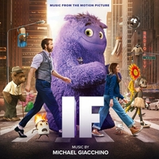

We begin with **Marty Supreme**: an operatic, high energy, 80s-styled score. Daniel Lopatin uses synths, organs, flutes and awestruck voices to depict an exciting descent into chaos... all through a fairytale lens. The blend of a retro-electronic aesthetic and vaguely-religious chanting choirs gives this soundtrack a very culty feeling.

I love how big it gets. It takes Marty's perspective on his own life, depicting the character as all kinds of big and important and impressive. I love a score that isn't afraid to stand out and make itself known, and this one certainly caught my attention in the best way.

---

## 24. **HADES II** – Darren Korb

**Hades II** brings us more of the same music we heard in the first game, and that's a great thing. Bigger and longer hypnotic rock rhythms drag us deeper into a cool and fantastical hell.

There's a solid few hours of exciting new music here, and I particularly love the way the long cues take the time to tell a story of a unique character or place. And the playful little rhythms are relentless and irresistible.

---

## 23. **LE SECRET DE MARTHA** – Romain Paillot

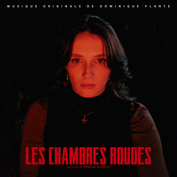

Here's the beautiful, sweeping classical melody of the year. In the vein of Rachel Portman or Alexandre Desplat, the main theme from **Le Secret De Martha** is rich and confident. With a sumptuous blend of piano, strings and woodwinds it finds that perfect register, that melodramatic angst that tugs at your heartstrings, but still with the restraint to never become too sappy or saccharine.

Just a really beautiful dramatic score that doesn't overstay its welcome.

---

## 22. **ANDOR (SEASON 2)** – Brandon Roberts

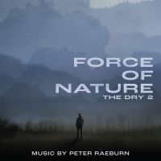

For **Andor**'s incredible second season, Brandon Roberts builds on Nicholas Britell's foundations; there's that gentle kind of tenderness, with relatively simple orchestrations, nothing too overbearing. The music on this show always feels aware that its underscoring some of the most electric drama ever put on TV, and for the most part it really doesn't have to do very much. But over the course of this score's three albums, the music deliberately starts reaching towards Michael Giacchino's *Rogue One*, slowly filling out the orchestra, slowly finding a greater sense of heroism -- if still tinged with tragic destiny.

There are also some exceptionally tense cues here that accompany the major set pieces towards the story's conclusion.

---

## 21. **OUTLANDER: BLOOD OF MY BLOOD (SEASON 1)** – Bear McCreary

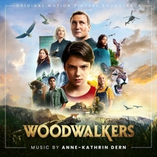

Outlander gained yet another beautiful Bear McCreary score for this series, which keeps the same musical template but introduces some more instantly-indellible new themes.

The wistful sense of romantic longing this series has excelled at since the beginning is still alive and well.

---

## 20. **KINGDOM COME: DELIVERANCE II** – Jan Valta

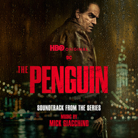

The first of several expansive video game scores on the list is **Kingdom Come: Deliverance II**. This one has a very warm and authentic tone, welcoming us into a grounded medieval setting.

For the most part it holds off from getting too heroic or grandiose, but when it does, I find it really thrilling. Proper medieval fantasy stuff.

---

## 19. **CLAIR OBSCUR: EXPEDITION 33** – Lorien Testard

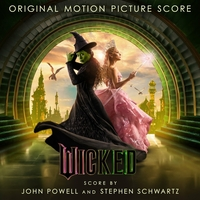

It's definitely one of the most popular game scores of 2025, and it's easy to see why. For most of us, **Clair Obscur** came seemingly out of nowhere with many (and I mean many) hours of beautiful melodic music. Small string sections and light piano give life to a range of very playful and expressive themes. And astonishing rich voices are often used to great effect, singing quirky and catchy French-ish lyrics, telling tales we can't directly understand, but we can feel.

This is a huge, dynamic musical journey that tells a rich story. And one with such a huge quantity of music that I don't know if I'll ever feel like I've got my ears around the whole thing.

---

## 18. **SWORD OF THE SEA** – Austin Wintory

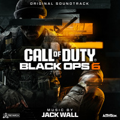

For as long as I've been aware of him, Austin Wintory has been one of the most exciting and prolific game composers around, putting out enviable quantities of wonderful music every year. **Sword of the Sea** is one of his latest works, and it puts many of his best traits on full display.

It has the sweeping adventure of *Journey*, the gentle nature-inspired sense of discovery of *Abzu*, the inventiveness of *The Banner Saga*, and the intelligent melodic richness of any Austin Wintory soundtrack. This is also just some of the cosiest, most warmly-inviting orchestration around.

---

## 17. **STAR WARS OUTLAWS: WILD CARD & A PIRATE'S FORTUNE** – Wilbert Roget, II & Cody Matthew Johnson

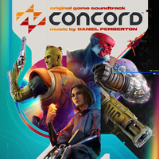

This is a most welcome expansion of the exceptional music that **Star Wars Outlaws** brought us in 2024. Again, the combination of classical John Williams ideas and the freshness of a slightly broader modern musical palette... it's so good, and I'd argue Star Wars has rarely sounded better or been more fun.

Every time Wilbert Roget, II does Star Wars I'm reminded of the brilliant *Star Wars: The Old Republic*, for which he played a significant role. There's so much of that DNA here, in the colourful little ideas, the choice of instrumentation, the playful ornamentation.

This isn't another one of those 5-10 hour long game scores; the album is only an hour long, and a chunk of that is cantina music. But the good stuff here is just so good. It's an absolute triumph.

---
## 16. **ABSOLUM** – Gareth Coker

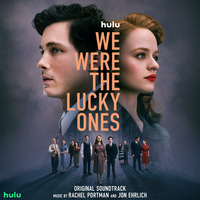

Another big game score here, and one that totally blew me away. If *Sword of the Sea* was a kind of showpiece for everything Austin Wintory can do, I think **Absolum** does the same for Gareth Coker.

There's a lot in the mix here... some *ARK* heaviness, some *Ori* magic, some *Immortals* fantasy.

Wistful, melancholy atmospheres and very striking melodies drew me into this one. It's instantly memorable stuff. It reminds me at times of *Recore*, one of my absolute favourite game scores of all time, with ethereal female voices and a small rock orchestra combining to create really inspiring, striving themes.

All in all, **Absolum** is absolutely beautiful.

---

## 15. **THE WAR BETWEEN THE LAND AND THE SEA** – Lorne Balfe

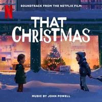

Lorne Balfe enters the Whoniverse for this epic spinoff soundtrack. You'd think as a massive Doctor Who fan I would have watched this by now, but I haven't. I've been loving the music though.

It's Lorne Balfe completely in *His Dark Materials* mode; stomping-big fantasy, styled in the manner of Hans Zimmer's Remote Control. In a way it's nothing we haven't heard from Balfe before, but this is just a really nice new package of it. There isn't much subtlety to it, but it's got a soul to it... there's heart and passion in here. More than anything, it's just fun to have such an easy-to-enjoy big new fantasy score like this.

---

## 14. **PERCY JACKSON AND THE OLYMPIANS (SEASON 2)** – Bear McCreary & Sparks & Shadows

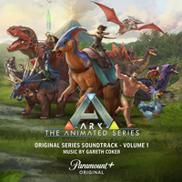

Musically, the second season of **Percy Jackson** leans pretty heavily on what worked before. But when what worked before was a colourful and heroic fantasy score full of great themes and action cues, that's a very good thing.

The track "Chariot Race" is just about as good as action cues get... dancing between a dozen motifs and ideas with real verve and panache.

Turns out Bear McCreary's team kinda know what they're doing. Go figure.

---

## 13. **PREDATOR: BADLANDS** – Sarah Schachner

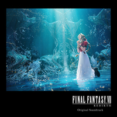

After Sarah Schachner's *Prey* a few years ago, I was very keen to hear what her next moves would be in the Predator universe. And **Predator: Badlands** is very cool. It dives headfirst into dark, huge and overbearing synth, incorporating very cool alien language as music, as well as dabbling with light and playful themes, like in the track "Meet Thia".

Despite clearly using so much synth and digital technology, there's also such a rich, tangible sound to this score. It sounds like things are physically being hammered and broken and twisted and destroyed to bring these sounds to our ears. Schachner's music for this series is one of the most unique and easily identifiable musical worlds in a recent film series, and I hope she gets the chance to build on it in future movies.

---

## 12. **DOCTOR WHO (SERIES 10)** – Murray Gold

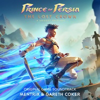

It's a pleasure to have Murray Gold's **Doctor Who** on one of my yearly lists for the first time. Even if it's for music he wrote nearly a decade ago.

The soundtrack for Series 10 was finally released late in 2025, and it's an absolute treat. I don't think it ever quite reaches the heights of Series 3 or Series 5, but that doesn't mean it's not one of the best things I heard all year.

Anyone who's already familiar with Murray Gold already knows this, but he cooks insanely hard on Doctor Who. He really is to Doctor Who as John Williams is to Star Wars, no doubt. Some of the most thrilling and open-hearted modern orchestral music out there.

Between Bill's theme and some incredible cues from the final few episodes of Series 10, this new album has plenty to offer.

---

## 11. **GHOST OF YOTEI** – Wataru Hokoyama, Toma Otowa

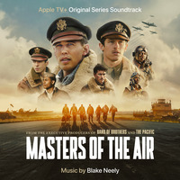

When I saw that there was a sequel to *Ghost of Tsushima*, I had some pretty high expectations for the music. Thankfully, **Ghost of Yotei** does not disappoint. This is a rousing epic, with beautiful Japanese instrumentation and a charming William Tell-esque giddy-up energy. There's also real sensitivity and pathos in this. Just like last time, as epic as things get, the most wonderful thing is how emotional the whole package is.

I'm also really glad that just like *Ghost of Tsushima*, this soundtrack features beautiful thematic songs that use the same melodies as the rest of the score. Love that.

---

## 10. **AVATAR: FIRE AND ASH** – Simon Franglen

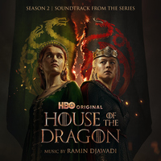

The third **Avatar** film is more of the same, but when it comes to the music I'd argue its never sounded better. I mean the soundtracks for this series have always been beautiful and luscious and inviting... but now it's all of that alongside a greater sense of confidence and maturity.

I think Simon Franglen managed to push the envelope a little further on this one. The orchestra just sounds so big and self-assured. James Horner's themes are now effortlessly intertwined with Franglen's own ideas. There's also some shocking, intense instrumentation for some of the film's bad guys.

This is the kind of epic classical orchestral score that we only seem to get a few times a year lately, but in my opinion its still the best sonic template out there.

---

## 9. **CREATION OF THE GODS II** – Gordy Haab

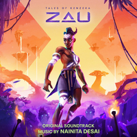

Speaking of the best sonic template out there... Gordy Haab delivers it big time in **Creation of the Gods II**. This is probably the biggest-sounding orchestra on my list this year. Like, not in an artificial Remote Control way, just a really big orchestra with a whole bunch of players. And it's having so much fun, with long, propulsive action cues filled with fist-pumping melodies.

I've listened to a lot of Gordy Haab's Star Wars music over the years, but I must say I actually liked this even more. It feels like removing the expectations of the Star Wars template allowed him to unleash a whole bunch of really dynamic ideas.

I also find a unique joy in these amazing scores for movies I've never heard of and I'll probably never see. The music is the entire experience for me here.

---

## 8. **AION2** – Simon Franglen, Ryo Kunihiko & NCSOUND

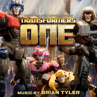

I've been a big fan of a lot of the **Aion** music in the past, so when I discovered there was a sequel with a nearly 4-hour-long album release... it was basically Christmas.

Then I listened to it, and it was the best Christmas ever. The orchestration and recording on much of this soundtrack blows me away. It has its moments of grandiosity, but it's also regularly intimate enough that you can hear all the authentic detail of the instruments.

A lot of these tracks play out like haunting lullabies, often reusing musical ideas from earlier Aion games, but with such stunning beauty that I never begrudged the retread.

And Simon Franglen is here again! I never would have expected him to join the world of Aion, but it's actually a perfect fit. His lush worlds intertwine with the existing DNA of Aion really elegantly.

Later in the album things mellow out into some fairly stock standard action stuff, but there's heaps to love here.

---

## 7. **DUNE: AWAKENING** – Knut Avenstroup Haugen

And here is the coolest score of the year, in my opinion. **Dune: Awakening** may take some inspiration from other Dune music we've heard in recent years, but it's also very much its own thing. And it's just incredibly cool.

There's an old-fashioned, sort of retro feel to this score. At times it feels straight out of a 90s video game, but with a richer sound. And that suits the world of Dune so well, which in itself is this sort of blend of past and future. 

I don't think this would work if it didn't sound so incredibly confident and self-assured, but oh boy, it sounds like it knows what it's doing, and it works brilliantly.

---

## 6. **CAPTAIN AMERICA: BRAVE NEW WORLD** – Laura Karpman & Nora Kroll-Rosenbaum

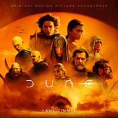

Laura Karpman goes in a completely different direction to her previous Marvel scores here. **Brave New World** sounds like a tense and exciting thriller, with some flourishes that certainly reminded me of Henry Jackman's *Winter Soldier*.

The instantly iconic main theme is built around a tight and controlled rhythm, which returns both softly and with great force throughout the soundtrack. I think it's brilliant to have this great hook that we can keep returning to so regularly and so effortlessly.

The movie itself may not live up to it, but this soundtrack is brilliantly dangerous and intense.

---

## 5. **HOLLOW KNIGHT: SILKSONG** – Christopher Larkin

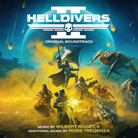

You know I delight in the rare opportunity to celebrate an Australian composer on my list. And Christopher Larkin deserves heaps of celebration for his gorgeous and enormous soundtrack for **Hollow Knight: Silksong**.

A bunch of cues here push the strings to the limits, driving breathless action with stunning dexterity. And as with so many of these great game soundtracks, there are really riveting quieter atmospheric tracks here too, painting vivid pictures of magical places.

I was lucky enough to hear some of this soundtrack played by the Adelaide Symphony Orchestra before the game even came out, which as you can imagine was an absolute thrill. It's a great one.

---

## 4. **F1** – Hans Zimmer

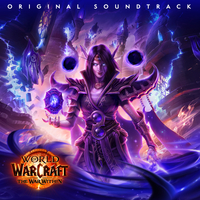

This is some of that pure Hans Zimmer crack, and I'll take it whenever I can get it.

Held together by Interstellar-like ticking percussion, **F1**'s powerful main themes are a perfect melding of heart, grit and awe.

It's not unlike things we've heard Zimmer do a bunch of times before, and it's not that unique or surprising, but it's just such a potent distillation of some of the best modern epic action writing. This score has one job: it should make me want to drive fast. And it absolutely does that.

---

## 3. **STAR WARS: SKELETON CREW** – Mick Giacchino

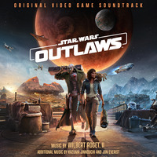

Mick Giacchino enters the Star Wars universe for some extremely charming light pirate-y adventure.

Well I say "light", but this also gets surprisingly dark. Mick Giacchino follows Jude Law's fantastic Long John Silver performance into some pretty dark and sinister places.

There's so much Star Wars in my favourite soundtracks every single year, and it's because composers keep coming in like this and taking what John Williams started and expanding it and taking it in fresh directions and just giving it new life. This score is so terrifically playful.

A little warning... there are different mixes depending on where you listen to this, and one sounds a lot better than the other. The streaming copy in a lot of places doesn't sound that great for some reason, but if you can get the CD version, that's the good stuff!

---

## 2. **MISSION: IMPOSSIBLE - THE FINAL RECKONING** – Max Aruj & Alfie Godfrey

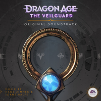

I loved Lorne Balfe's *Dead Reckoning* soundtrack so much that when I heard he was no longer working on **The Final Reckoning**, I was pretty disappointed.

But these composers I'd never heard of, Max Aruj and Alfie Godrey, totally surprised me with my second-favourite score of the year.

The film itself may be a bit of a mess, but musically The Final Reckoning effectively continues in Lorne Balfe's footsteps with an incredibly bombastic action score. This is like Hans Zimmer's Remote Control sound being taken to the extreme, if that's even possible. It's so over the top, in a way that I definitely wouldn't want every score to be. But in this case, it really works.

This is action melodrama on the biggest scale imaginable.

---

## 1. **THE FANTASTIC FOUR: FIRST STEPS** – Michael Giacchino

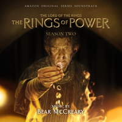

**Fantastic Four: First Steps** is utterly delightful, and an easy pick for my favourite score of the year!

This is probably my favourite Michael Giacchino score since *Doctor Strange*. It's just a full-throated and sophisticated superhero score which isn't too cool to sing its own title for the main theme. That's hard to pull off, and very few get away with it... but just like *Robocop 2*, here it works. It's fun and cheeky and playful, but not a joke.

The space-faring optimism seeded throughout this soundtrack is really exciting, and it's perfectly balanced by darker themes with real stakes. The villain material here is just as good as any of the heroic material, and gives the score as a whole such fantastic light and shade.

Did I say fantastic? Yeah, let's go with that.

---

## Wrapping Up

This was another pretty good year for music. I think there was *heaps* of "good" music, enough that (as usual) it would have been easier to make a much longer list.

There maybe weren't as many real-standouts this year, compared to previous years. As much as I do love the top three scores on this list, I think it's one of the weaker top threes I've had in the seven years that I've done this list. Just not as many scores that I'd give 10/10 top marks.

As always, I feel bad about all the things I couldn't fit on the list. But I did decide I didn't really *need* to include great new albums that were extremely similar to things we've heard before... like John Powell's new *How To Train Your Dragon*. 

The split across categories this year was almost exactly the same as last year. Not quite sure how I managed that! But I again had 6 TV shows, 9 movies, and a slightly larger share of video games with 10 on the list.

Nothing on my list was nominated at the Academy Awards this year. It is kinda wild how infrequently that seems to align.

Let's see, any composer double ups? Well Bear McCreary's here twice. Both Mick and Michael Giacchino are in the top 3. And surprisingly, Simon Franglen appeared twice. Couldn't have anticipated that!

As always, thanks for watching. I really enjoy making these, and it's really good icing on the cake if anyone enjoys watching them.

Should be a good list next year... I've already been listening to some amazing new releases for 2026. Until next time!